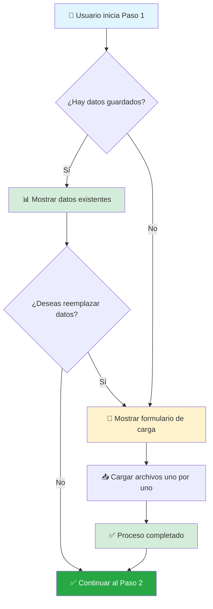
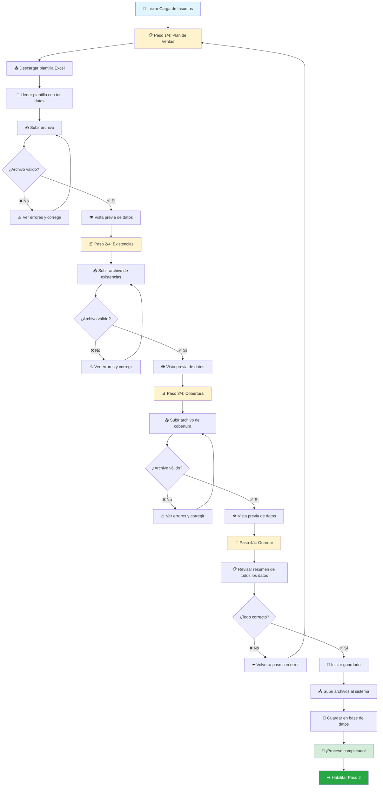
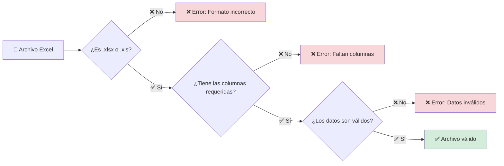
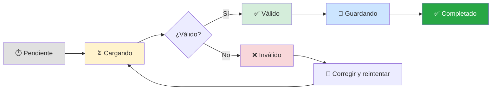
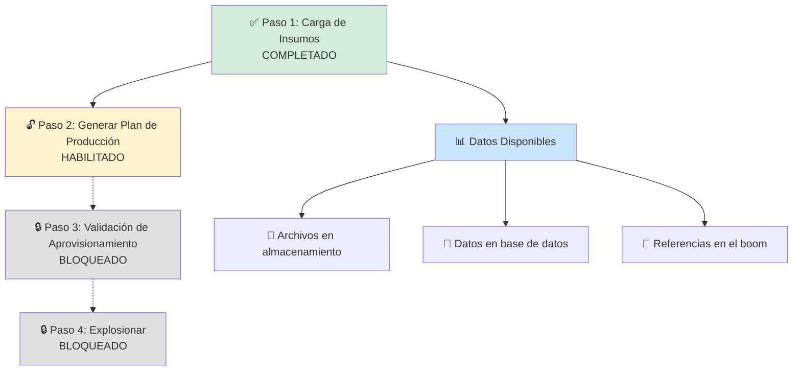
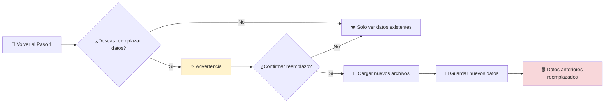

# Paso 1: Carga de Insumos - Guía de Usuario

## 📋 ¿Qué es este paso?

El **Paso 1: Carga de Insumos** es el primer paso fundamental en el proceso de Explosión de Materiales. En este paso, debes cargar 3 archivos Excel que contienen información esencial sobre ventas, inventarios y cobertura de tu empresa.

Piensa en este paso como preparar todos los ingredientes antes de cocinar: necesitas tener todos los datos listos y organizados antes de poder calcular las necesidades de producción.

## 🎯 Objetivo

Cargar y validar los datos iniciales necesarios para todo el proceso de explosión de materiales. Sin estos datos, los pasos siguientes no pueden ejecutarse.

## 📂 Los 3 Archivos Que Debes Cargar

### 1️⃣ Plan de Ventas

**¿Qué es?**
Es un archivo que contiene las ventas que tienes proyectadas para los próximos meses. Este archivo le dice al sistema cuánto esperas vender de cada producto.

**¿Para qué sirve?**
El sistema usa esta información para calcular cuánto necesitas producir para cumplir con tus metas de venta.

**Información que contiene:**
- Versión del plan
- Fecha de planificación (mes, semana, día)
- Código de los materiales
- Cantidades planificadas
- Centros de distribución
- Unidades de medida

**⚠️ Importante:** La versión en este archivo debe coincidir exactamente con la versión del boom que estás creando.

### 2️⃣ Existencias

**¿Qué es?**
Es un archivo que muestra el inventario actual de materiales que tienes en tus bodegas y almacenes.

**¿Para qué sirve?**
El sistema necesita saber qué inventario ya tienes disponible para no pedirte que produzcas materiales que ya están en stock.

**Información que contiene:**
- Versión del reporte
- Centro y almacén
- Código del material
- Cantidades disponibles en diferentes estados:
  - Libre para uso
  - No liberado
  - Bloqueado
  - En devolución
  - En traslado
  - En control de calidad

**⚠️ Importante:** La versión debe coincidir con la del boom y el plan de ventas.

### 3️⃣ Cobertura

**¿Qué es?**
Es un archivo que define los días hábiles de trabajo en cada centro de distribución.

**¿Para qué sirve?**
El sistema necesita saber cuántos días hábiles tiene cada planta para calcular correctamente los tiempos de producción.

**Información que contiene:**
- Versión del reporte
- Centro de distribución
- Período y mes
- Días hábiles en la planta
- Días de cobertura
- Días hábiles de venta

## 🔄 Proceso Completo Paso a Paso

### Vista General del Proceso



### Proceso Detallado de Carga



## 📝 Guía Detallada de Uso

### Paso 1: Cargar Plan de Ventas

#### 1. Descargar la Plantilla
- En la pantalla del **Paso 1/4: Plan de Ventas**, haz clic en el botón **"Descargar Plantilla Excel"**
- Se descargará un archivo Excel con el formato correcto

#### 2. Llenar la Plantilla
- Abre el archivo en Microsoft Excel o similar
- Verás que tiene columnas específicas (SSOUR, VRSIO, SPMON, etc.)
- Llena cada fila con los datos de tus ventas planificadas
- **Importante:** La columna VRSIO debe tener el mismo número de versión que tu boom

#### 3. Subir el Archivo
- Arrastra el archivo Excel al área indicada, o
- Haz clic en **"Seleccionar archivo"** y busca tu archivo
- El sistema validará automáticamente el archivo

#### 4. Vista Previa
- Si el archivo es válido, verás una tabla con los primeros 10 registros
- Verás también estadísticas como:
  - Número total de registros
  - Nombre del archivo
  - Fecha de carga

#### 5. Continuar al Siguiente Paso
- Si todo está correcto, haz clic en el botón **"Siguiente"**
- El sistema guardará los datos en memoria y te llevará al siguiente paso

### Paso 2: Cargar Existencias

El proceso es similar al Paso 1:

1. **Subir archivo** de existencias (no hay plantilla para este archivo)
2. **El sistema valida** que la versión coincida con la del boom
3. **Vista previa** de los datos cargados
4. **Continuar** al siguiente paso

**Diferencias importantes:**
- No hay plantilla para descargar
- Debes asegurarte que el archivo tenga las columnas correctas
- La validación de versión es estricta

### Paso 3: Cargar Cobertura

Similar a los pasos anteriores:

1. **Subir archivo** de cobertura
2. **Validación automática** del formato
3. **Vista previa** de datos
4. **Continuar** al paso final

**Nota:** Para este archivo no se valida la versión de forma estricta.

### Paso 4: Guardar Datos

Este es el paso final donde el sistema guarda toda la información:

#### ¿Qué verás?

**Resumen de Todos los Datos:**
```
📊 RESUMEN DE DATOS CARGADOS

✅ Plan de Ventas
   📄 Archivo: plan_ventas_275.xlsx
   📊 Registros: 1,524
   📅 Cargado: 15/01/2025 10:30 AM

✅ Existencias
   📄 Archivo: existencias_275.xlsx
   📊 Registros: 3,847
   📅 Cargado: 15/01/2025 10:35 AM

✅ Cobertura
   📄 Archivo: cobertura_275.xlsx
   📊 Registros: 156
   📅 Cargado: 15/01/2025 10:38 AM

📈 TOTAL: 5,527 registros
```

#### ¿Qué hace el sistema?

1. **Verifica** que todos los datos sean correctos
2. **Sube los archivos** originales al almacenamiento
3. **Guarda los datos** en la base de datos
4. **Muestra el progreso** en tiempo real

#### Barra de Progreso

Verás una barra de progreso que muestra el avance:

```
Procesando datos...
████████████░░░░░░░░░░░░░░░░ 45%

📦 Procesando Plan de Ventas... ✅ Completado
📦 Procesando Existencias... ⏳ En progreso (lote 3 de 4)
📦 Procesando Cobertura... ⏱️ Pendiente
```

#### ¿Cuánto tarda?

El tiempo de procesamiento depende del tamaño de tus archivos:
- Archivos pequeños (< 1,000 registros): 1-2 minutos
- Archivos medianos (1,000 - 10,000 registros): 2-5 minutos
- Archivos grandes (> 10,000 registros): 5-15 minutos

## 🔍 Validaciones Automáticas

El sistema realiza varias validaciones para asegurar que tus datos sean correctos:

### ✅ Validación de Formato



### ✅ Validación de Versión

Para **Plan de Ventas** y **Existencias**, el sistema verifica que:
- Todos los registros tengan la misma versión
- La versión coincida con la versión del boom

**Ejemplo:**
- Si tu boom es versión **275**
- Todos los registros deben tener versión **275**
- Si encuentras un registro con versión **274**, el sistema te alertará

### ✅ Validación de Datos

El sistema verifica que:
- Los campos obligatorios no estén vacíos
- Los números sean números válidos
- Las fechas tengan formato correcto
- No haya caracteres extraños

## 🎓 Tour Guiado

La primera vez que entres al Paso 1, verás un botón azul en la esquina superior derecha:

**🔵 Tour: Carga de Insumos**

Al hacer clic, se iniciará un tour interactivo que te mostrará:

1. **Cómo funciona el stepper** (los 4 pasos)
2. **Dónde descargar las plantillas**
3. **Cómo cargar archivos**
4. **Dónde ver la vista previa**
5. **Cómo navegar entre pasos**

Este tour es opcional pero muy recomendado para usuarios nuevos.

## ⚠️ Errores Comunes y Soluciones

### Error: "Versión incorrecta"

**Mensaje:**
```
⚠️ Se encontraron 50 registros con versión incorrecta
Versión esperada: 275
Versión encontrada: 274
```

**¿Qué significa?**
Algunos registros en tu archivo tienen una versión diferente a la del boom que estás creando.

**¿Cómo solucionarlo?**
1. Abre el archivo Excel
2. Verifica la columna de versión (VRSIO o version)
3. Corrige los registros con versión incorrecta
4. Guarda el archivo y vuelve a subirlo

### Error: "Faltan columnas requeridas"

**Mensaje:**
```
❌ El archivo no tiene la estructura correcta
Faltan las siguientes columnas: VRSIO, SPMON, PMNUX
```

**¿Qué significa?**
Tu archivo no tiene todas las columnas que el sistema necesita.

**¿Cómo solucionarlo?**
1. Descarga la plantilla oficial
2. Copia tus datos a la plantilla
3. Asegúrate de no eliminar ninguna columna
4. Vuelve a subir el archivo

### Error: "El archivo está vacío"

**Mensaje:**
```
❌ El archivo no contiene datos
```

**¿Qué significa?**
El archivo Excel no tiene registros o solo tiene los encabezados.

**¿Cómo solucionarlo?**
1. Verifica que el archivo tenga datos en las filas
2. Asegúrate de estar subiendo el archivo correcto
3. Intenta abrir el archivo para confirmar que tiene contenido

### Error: "No se pudo conectar a la base de datos"

**Mensaje:**
```
❌ Error al guardar los datos
Por favor, intenta nuevamente en unos minutos
```

**¿Qué significa?**
Hubo un problema temporal con el servidor.

**¿Qué hacer?**
1. Espera 2-3 minutos
2. Haz clic en el botón **"Reintentar"**
3. Si el problema persiste, contacta al soporte técnico

## 📊 Indicadores de Estado

### Estados de Cada Paso

Durante el proceso, verás diferentes indicadores de estado:



### Iconos de Estado

| Icono | Estado | Significado |
|-------|--------|-------------|
| ⏱️ | Pendiente | Aún no se ha cargado el archivo |
| ⏳ | Cargando | El archivo se está procesando |
| ✅ | Válido | El archivo es correcto y está listo |
| ❌ | Inválido | Hay errores que debes corregir |
| 💾 | Guardando | Los datos se están guardando |
| ✅ | Completado | El paso está completado exitosamente |

## 📈 ¿Qué Sucede Después?

Una vez que completes el Paso 1:



### 1. El Paso 2 se Habilita Automáticamente

Ya podrás acceder al **Paso 2: Generar Plan de Producción** donde el sistema:
- Sincronizará los datos con sistemas externos
- Calculará el plan de ventas
- Generará el plan de demanda

### 2. Tus Datos se Guardan de Forma Segura

Los datos quedan almacenados en:
- **Archivos originales**: En el almacenamiento del sistema
- **Base de datos**: Para consultas rápidas
- **Registro del boom**: Para trazabilidad

### 3. Puedes Revisar los Datos en Cualquier Momento

Si vuelves al Paso 1 después de completarlo, verás:
- Una vista de todos los datos cargados
- Estadísticas y resúmenes
- Opción para reemplazar los datos si es necesario

## 🔄 Reutilización de Datos

### ¿Puedo Modificar los Datos Después de Guardarlos?

**Sí**, puedes volver al Paso 1 y cargar nuevos archivos. El sistema:



**⚠️ Importante:** Si reemplazas los datos, los archivos anteriores se eliminarán y deberás repetir los pasos siguientes.

## 📋 Lista de Verificación

Antes de considerar completo el Paso 1, verifica que:

- [ ] Subiste el archivo de **Plan de Ventas**
- [ ] Subiste el archivo de **Existencias**
- [ ] Subiste el archivo de **Cobertura**
- [ ] Todos los archivos pasaron las validaciones
- [ ] Revisaste las vistas previas de datos
- [ ] Confirmaste el guardado final
- [ ] Viste el mensaje de **"Proceso completado exitosamente"**
- [ ] El **Paso 2** está ahora habilitado

## 💡 Consejos y Mejores Prácticas

### 📝 Al Preparar tus Archivos

1. **Usa las plantillas oficiales** siempre que estén disponibles
2. **Verifica la versión** antes de subir los archivos
3. **Revisa que no haya celdas vacías** en campos obligatorios
4. **Guarda copias de respaldo** de tus archivos originales
5. **Usa nombres descriptivos** para tus archivos (ej: plan_ventas_275_enero.xlsx)

### 🚀 Durante el Proceso

1. **No cierres la ventana** mientras se están guardando los datos
2. **Espera a que cada paso complete** antes de continuar
3. **Revisa las estadísticas** mostradas en cada vista previa
4. **Toma nota de cualquier error** para corregirlo en el archivo

### ✅ Después de Completar

1. **Verifica que el Paso 2 esté habilitado**
2. **Guarda tus archivos originales** para referencia futura
3. **Documenta cualquier cambio** que hayas hecho a los datos
4. **Continúa al Paso 2** para mantener el flujo del proceso

## 🆘 ¿Necesitas Ayuda?

Si tienes problemas durante el proceso:

1. **Revisa esta guía** para encontrar la solución
2. **Usa el Tour Guiado** si es tu primera vez
3. **Verifica los mensajes de error** que aparecen en pantalla
4. **Contacta al soporte técnico** si el problema persiste

**Información de Contacto:**
- 📧 Email: soporte@empresa.com
- 📞 Teléfono: +123 456 7890
- 💬 Chat: Disponible en la aplicación

## 📚 Documentación Relacionada

Para más información sobre otros aspectos del proceso:

- [Guía General de Explosión de Materiales](./README-explosion-materiales.md)
- [Paso 2: Generar Plan de Producción](./explosion-materiales-paso2-plan-produccion.md)
- [Arquitectura del Sistema](./explosion-materiales-architecture.md)

---

**Última actualización**: Enero 2025

**Versión del documento**: 1.0

**Equipo**: Portal Diveco

