# Paso 2: Generar Plan de Producción - Guía de Usuario

## 📋 ¿Qué es este paso?

El **Paso 2: Generar Plan de Producción** es el segundo paso del proceso de Explosión de Materiales. En este paso, el sistema toma los datos que cargaste en el Paso 1 y los procesa automáticamente para generar un plan de producción completo.

Este paso es completamente automático: solo debes hacer clic en un botón y el sistema ejecutará 3 procesos en secuencia. Piensa en esto como una receta de cocina donde cada ingrediente (los datos del Paso 1) se procesa en orden para crear el plato final (el plan de producción).

## 🎯 Objetivo

Generar un plan de producción detallado mediante la ejecución secuencial de 3 procesos automatizados que sincronizan datos, calculan ventas y determinan las necesidades de producción.

## 🔄 Los 3 Procesos Secuenciales

Este paso ejecuta 3 procesos que **deben completarse en orden**. No puedes saltar del proceso 1 al 3; cada uno depende del anterior.

### 1️⃣ Sincronizar Insumos

**¿Qué hace?**
Extrae y sincroniza los datos de los archivos que subiste en el Paso 1 (Plan de Ventas, Existencias y Cobertura) con los sistemas de la empresa.

**¿Por qué es importante?**
Este proceso prepara y organiza todos los datos para que puedan ser utilizados por los procesos siguientes. Es como lavar y picar los ingredientes antes de cocinar.

**¿Cuánto tarda?**
Generalmente entre 5 y 15 minutos, dependiendo de la cantidad de datos.

**Lo que verás:**
- Estado: "Ejecutando..."
- Un ícono girando que indica que el proceso está en marcha
- ID de ejecución del proceso

### 2️⃣ Sincronizar Plan de Ventas

**¿Qué hace?**
Toma el plan de ventas que subiste y lo sincroniza con los datos recién procesados del primer paso. Calcula las proyecciones de venta actualizadas.

**¿Por qué es importante?**
Este proceso asegura que las proyecciones de venta estén alineadas con el inventario actual y las capacidades de producción.

**¿Cuánto tarda?**
Generalmente entre 3 y 10 minutos.

**Lo que verás:**
- El proceso 1 debe estar completado (con ✓ verde)
- Estado: "Ejecutando..."
- Barra de progreso actualizada

### 3️⃣ Calcular Plan de Demanda

**¿Qué hace?**
Combina toda la información sincronizada (insumos + plan de ventas) y calcula cuánto necesitas producir de cada material para cumplir con las proyecciones de venta.

**¿Por qué es importante?**
Este es el proceso final que genera el plan de producción real. Te dice exactamente qué y cuánto producir.

**¿Cuánto tarda?**
Generalmente entre 5 y 20 minutos, dependiendo de la complejidad de los cálculos.

**Lo que verás:**
- Los procesos 1 y 2 deben estar completados
- Estado: "Ejecutando..."
- Barra de progreso al 100% cuando termina

## 🔄 Flujo Completo del Proceso

### Diagrama del Proceso

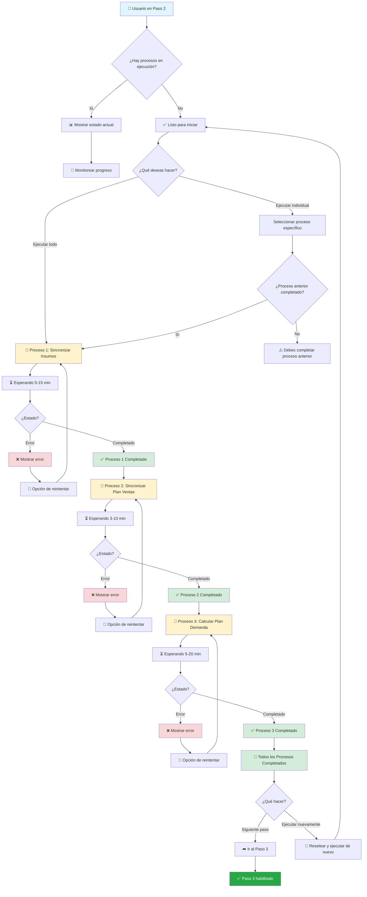

### Estados de Cada Proceso

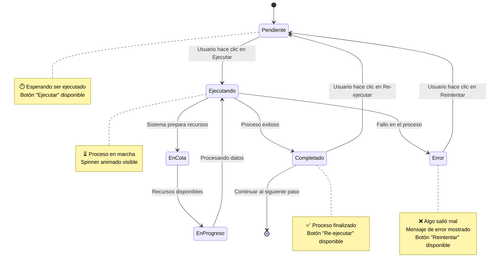

## 📝 Guía Detallada de Uso

### Opción 1: Ejecutar Todos los Procesos Automáticamente

Esta es la forma más sencilla y recomendada.

#### Pasos:

1. **Verificar Prerequisitos**
   - Asegúrate de haber completado el Paso 1 (Carga de Insumos)
   - Los 3 archivos deben estar cargados correctamente

2. **Hacer Clic en "Iniciar Todos los Procesos"**
   - Verás un botón grande en la parte inferior
   - Al hacer clic, el sistema comenzará automáticamente

3. **Observar el Progreso**
   - Verás una barra de progreso que se actualiza en tiempo real
   - Cada proceso muestra su estado individual:
     ```
     1⃣ Sincronizar Insumos         ✅ Completado
     2⃣ Sincronizar Plan de Ventas  ⏳ Ejecutando...
     3⃣ Calcular Plan de Demanda    ⏱️ Pendiente
     
     📊 Progreso Global: 33% (1 de 3 completado)
     ```

4. **Esperar a que Termine**
   - No es necesario que permanezcas en la página
   - Puedes cerrar la pestaña y volver más tarde
   - El progreso se guarda automáticamente

5. **Continuar al Siguiente Paso**
   - Cuando todos los procesos estén completados, verás:
     ```
     🎉 ¡Todos los Procesos Completados!
     
     [🔄 Ejecutar Nuevamente]  [➡️ Siguiente Paso]
     ```

### Opción 2: Ejecutar Procesos Individuales

Si prefieres tener más control, puedes ejecutar cada proceso manualmente.

#### Pasos:

1. **Ejecutar Proceso 1**
   - Haz clic en el botón "Ejecutar" junto a "Sincronizar Insumos"
   - Espera a que se complete (verás un ✓ verde)

2. **Ejecutar Proceso 2**
   - Solo después de que el Proceso 1 esté completado
   - Haz clic en "Ejecutar" junto a "Sincronizar Plan de Ventas"
   - Espera a que se complete

3. **Ejecutar Proceso 3**
   - Solo después de que los Procesos 1 y 2 estén completados
   - Haz clic en "Ejecutar" junto a "Calcular Plan de Demanda"
   - Espera a que se complete

### Si un Proceso Falla

Si algún proceso muestra un error:

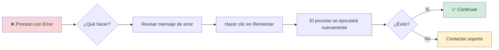

## 📊 Indicadores Visuales

### Barra de Progreso

Cuando todos los procesos están ejecutándose, verás una barra de progreso:

```
Ejecutando procesos secuencialmente...

████████████░░░░░░░░░░░░░░░░ 45%

2 de 3 procesos completados (1 ejecutándose)

• Sincronizar Insumos         ✅
• Sincronizar Plan de Ventas  ✅
• Calcular Plan de Demanda    🔵 (ejecutando)
```

### Estados de Proceso

Cada proceso muestra su estado con colores e iconos:

| Estado | Icono | Color | Significado |
|--------|-------|-------|-------------|
| Pendiente | ⏱️ | Gris | Esperando ser ejecutado |
| En Cola | ⏳ | Cyan claro | Preparándose para ejecutar |
| Ejecutando | 🔄 | Cyan | Procesando datos |
| Completado | ✅ | Verde | Finalizado exitosamente |
| Error | ❌ | Rojo | Falló, se puede reintentar |

### Vista de Cada Proceso

```
┌─────────────────────────────────────────────────────────┐
│ 1  🔄  Sincronizar Insumos                    ⏳ Ejecutando... │
│     Ejecución del pipeline de extracción       🔌 a1b2c3d4 │
│     de insumos                                              │
│                                                             │
│     [Ver en sistema externo] ←---- Opcional                │
└─────────────────────────────────────────────────────────┘
```

## ⏱️ Tiempos de Ejecución

### Tiempos Estimados

Los tiempos varían según la cantidad de datos:

```mermaid
gantt
    title Duración Estimada de Procesos
    dateFormat  mm
    axisFormat  %M min
    
    section Proceso 1
    Sincronizar Insumos (Mínimo)    :a1, 05, 5m
    Sincronizar Insumos (Promedio)  :a2, 10, 10m
    Sincronizar Insumos (Máximo)    :a3, 15, 15m
    
    section Proceso 2
    Plan de Ventas (Mínimo)         :b1, 03, 3m
    Plan de Ventas (Promedio)       :b2, 06, 6m
    Plan de Ventas (Máximo)         :b3, 10, 10m
    
    section Proceso 3
    Plan de Demanda (Mínimo)        :c1, 05, 5m
    Plan de Demanda (Promedio)      :c2, 12, 12m
    Plan de Demanda (Máximo)        :c3, 20, 20m
```

### Tiempo Total Estimado

- **Mínimo**: 13 minutos (5 + 3 + 5)
- **Promedio**: 28 minutos (10 + 6 + 12)
- **Máximo**: 45 minutos (15 + 10 + 20)

**💡 Consejo**: Puedes iniciar el proceso y continuar con otras tareas. El sistema te notificará cuando termine.

## 🔍 Monitoreo del Progreso

### Actualización Automática

El sistema verifica el estado de los procesos cada 10 segundos:

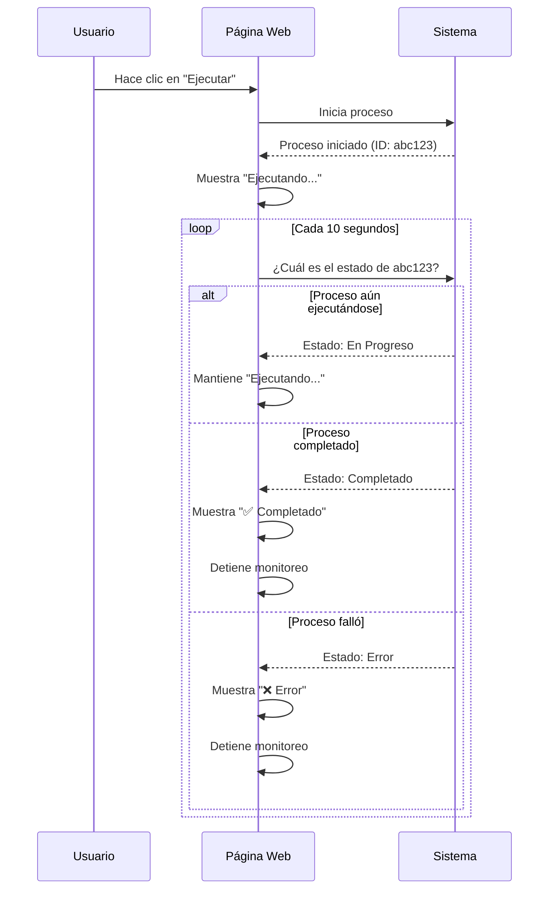

### Información en Tiempo Real

Mientras los procesos se ejecutan, verás:

```
🔄 Sincronizar Insumos
   Estado: Ejecutando...
   ID de Ejecución: a1b2c3d4
   Inicio: 10:30 AM
   Transcurrido: 5 min 23 seg
```

## 🎓 Tour Guiado

Al igual que el Paso 1, este paso también tiene un tour interactivo.

### Cómo Iniciarlo

1. Busca el botón azul en la esquina superior derecha: **🔵 Tour: Plan de Producción**
2. Haz clic para iniciar el tour
3. Sigue las instrucciones en pantalla

### Qué Aprenderás

El tour te mostrará:

1. **Dónde está el proceso de Plan de Producción** en la página
2. **Qué significa cada icono de estado**
3. **Los 3 procesos secuenciales** y para qué sirve cada uno
4. **Cómo ejecutar los procesos** (automático vs individual)
5. **Cómo interpretar el progreso**

## ⚠️ Situaciones Especiales

### Si Cierras la Página

**¿Qué pasa si cierro la ventana mientras los procesos se ejecutan?**

✅ **No hay problema**:
- Los procesos continúan ejecutándose en el servidor
- Cuando vuelvas, verás el estado actualizado
- El progreso se guarda automáticamente

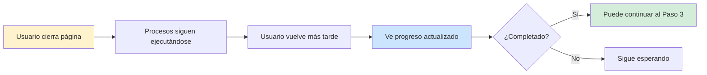

### Si Ya Completaste este Paso Antes

Si vuelves a este paso después de haberlo completado:

```
✅ Todos los Procesos Completados

1⃣ Sincronizar Insumos         ✅ Completado
2⃣ Sincronizar Plan de Ventas  ✅ Completado
3⃣ Calcular Plan de Demanda    ✅ Completado

[🔄 Ejecutar Nuevamente]  [➡️ Siguiente Paso]
```

**Opciones**:
- **Siguiente Paso**: Ir directamente al Paso 3
- **Ejecutar Nuevamente**: Volver a ejecutar todos los procesos (reemplazará los datos anteriores)

### Si Hay un Error Persistente

Si un proceso falla repetidamente después de varios reintentos:

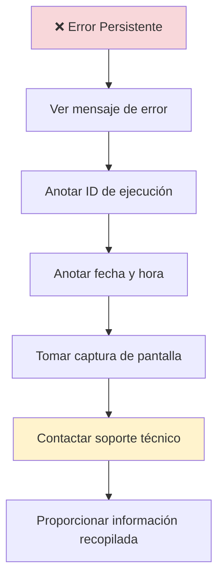

**Información a proporcionar al soporte**:
- ID de ejecución del proceso (ej: a1b2c3d4)
- Mensaje de error completo
- Fecha y hora del error
- Versión del boom
- Captura de pantalla

## 🔄 Re-ejecutar Procesos

### Cuándo Re-ejecutar

Puedes necesitar re-ejecutar los procesos si:

- **Actualizaste los datos** del Paso 1
- **Un proceso falló** y quieres reintentar
- **Necesitas datos más recientes** del sistema

### Cómo Re-ejecutar

#### Re-ejecutar Todos los Procesos

1. Haz clic en el botón **"Ejecutar Nuevamente"**
2. Confirma la acción
3. Todos los procesos se resetearán y ejecutarán de nuevo

```
⚠️ ¿Estás seguro que deseas ejecutar nuevamente?

Los datos anteriores serán reemplazados.

[Cancelar]  [Sí, ejecutar nuevamente]
```

#### Re-ejecutar un Proceso Individual

1. Busca el proceso que deseas re-ejecutar
2. Haz clic en el botón **"Re-ejecutar"** junto a ese proceso
3. Solo ese proceso se ejecutará nuevamente

**⚠️ Importante**: Si re-ejecutas un proceso intermedio (ej: Proceso 2), los procesos siguientes (ej: Proceso 3) también se ejecutarán automáticamente.

## 📈 Progreso Secuencial

### Dependencias Entre Procesos

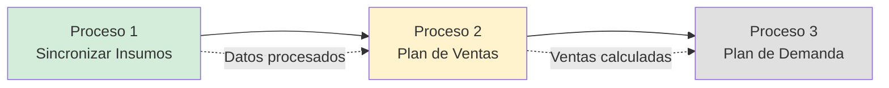

**Regla importante**: No puedes ejecutar un proceso si el anterior no está completado.

**Ejemplo**:
```
❌ Incorrecto:
   Proceso 1: ⏱️ Pendiente
   Proceso 2: [Ejecutar] ← BLOQUEADO
   
✅ Correcto:
   Proceso 1: ✅ Completado
   Proceso 2: [Ejecutar] ← DISPONIBLE
```

### Mensaje de Dependencia

Si intentas ejecutar un proceso sin completar el anterior:

```
⚠️ No se puede ejecutar

Debe completar primero: Sincronizar Insumos

[Aceptar]
```

## ✅ Indicador de Completitud del Paso

### Cuándo se Considera Completo

El Paso 2 está completo cuando:

```
✅ Proceso 1: Completado
✅ Proceso 2: Completado  
✅ Proceso 3: Completado

= 🎉 ¡Paso 2 Completado!
```

### Qué Sucede Después

Cuando completes el Paso 2:

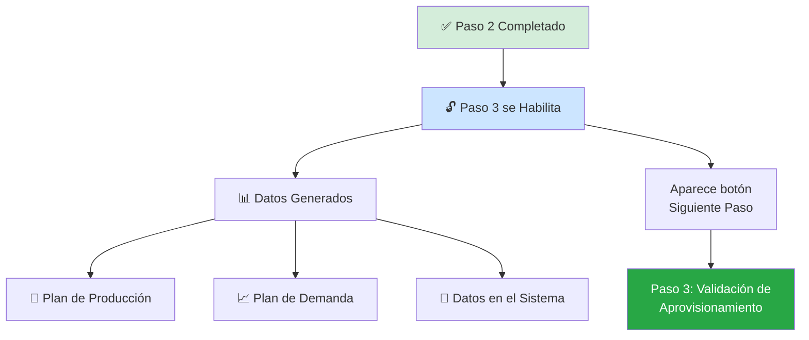

**Verás**:
- Un mensaje de éxito
- El botón "Siguiente Paso" habilitado
- El Paso 3 disponible en el menú principal

## 💡 Consejos y Mejores Prácticas

### ✅ Antes de Iniciar

- [ ] Verifica que completaste el Paso 1
- [ ] Asegúrate de tener buena conexión a internet
- [ ] Ten tiempo disponible (mínimo 15 minutos)
- [ ] Cierra otras pestañas pesadas del navegador

### ⏳ Durante la Ejecución

- **Puedes cerrar la ventana** - Los procesos seguirán ejecutándose
- **No es necesario quedarte mirando** - Vuelve cuando estimes que haya terminado
- **Revisa cada 10 minutos** si quieres monitorear el progreso
- **Toma nota del ID de ejecución** por si necesitas soporte

### 🎯 Después de Completar

- **Verifica que todos los procesos muestren ✅**
- **Si alguno falló, reintenta antes de continuar**
- **Anota cualquier anomalía** para reportar después
- **Continúa al Paso 3** cuando estés listo

### 🚫 Qué NO Hacer

- ❌ No actualices la página mientras los procesos se ejecutan
- ❌ No ejecutes el mismo proceso varias veces simultáneamente
- ❌ No intentes saltar al Paso 3 si este paso no está completo
- ❌ No modifiques los datos del Paso 1 mientras este paso se ejecuta

## 🔗 Integración con Otros Pasos

### Datos del Paso Anterior (Paso 1)

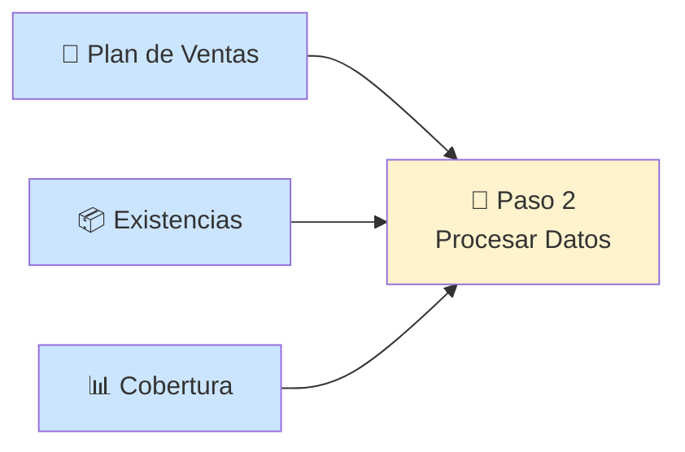

El Paso 2 usa TODOS los archivos que subiste en el Paso 1.

### Datos para el Paso Siguiente (Paso 3)

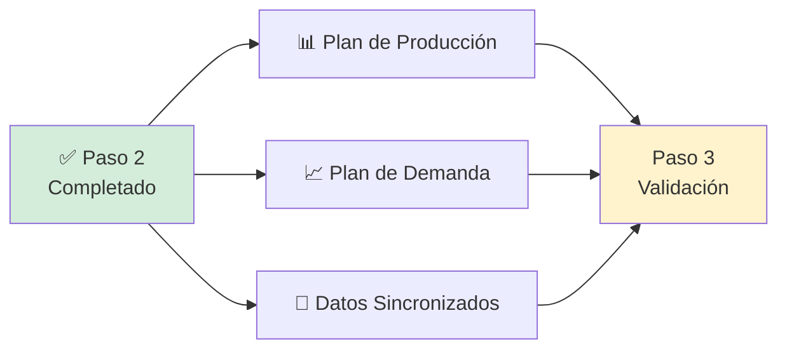

El Paso 3 necesita que este paso esté completado para validar los materiales.

## 📋 Lista de Verificación

Antes de continuar al Paso 3, verifica que:

- [ ] Los 3 procesos muestran **✅ Completado**
- [ ] No hay procesos en estado de **❌ Error**
- [ ] Viste el mensaje **"Todos los Procesos Completados"**
- [ ] El botón **"Siguiente Paso"** está disponible
- [ ] Anotaste los IDs de ejecución (opcional, para referencia)

## ❓ Preguntas Frecuentes

### ¿Puedo pausar los procesos?

**No**, una vez iniciados, los procesos deben completarse. Sin embargo, puedes cerrar la ventana y volver después.

### ¿Qué pasa si mi computadora se apaga?

**No hay problema**. Los procesos se ejecutan en el servidor, no en tu computadora. Cuando vuelvas a abrir la aplicación, verás el progreso actualizado.

### ¿Puedo ejecutar varios booms al mismo tiempo?

**Sí**, cada boom tiene sus propios procesos independientes. Puedes trabajar en varios booms simultáneamente.

### ¿Cómo sé si un proceso falló?

Verás un ícono **❌** rojo junto al proceso y un mensaje explicando el error. También tendrás un botón **"Reintentar"**.

### ¿Puedo modificar los datos del Paso 1 mientras este paso se ejecuta?

**No es recomendable**. Si modificas los datos del Paso 1, deberás re-ejecutar todos los procesos del Paso 2.

### ¿Cuántas veces puedo re-ejecutar los procesos?

**Todas las veces que necesites**. No hay límite, pero ten en cuenta que cada ejecución tomará tiempo.

## 🆘 ¿Necesitas Ayuda?

Si encuentras problemas:

1. **Revisa esta guía** para encontrar la solución
2. **Usa el Tour Guiado** si tienes dudas sobre la interfaz
3. **Anota el ID de ejecución** y el mensaje de error
4. **Contacta al soporte técnico** con la información recopilada

**Información de Contacto**:
- 📧 Email: soporte@empresa.com
- 📞 Teléfono: +123 456 7890
- 💬 Chat: Disponible en la aplicación (esquina inferior derecha)

## 📚 Documentación Relacionada

Para más información:

- [Paso 1: Carga de Insumos](./explosion-materiales-paso1-carga-insumos.md)
- [Paso 3: Validación de Aprovisionamiento](./explosion-materiales-paso3-validacion.md)
- [Guía General de Explosión de Materiales](./README-explosion-materiales.md)

---

**Última actualización**: Enero 2025

**Versión del documento**: 1.0

**Equipo**: Portal Diveco

