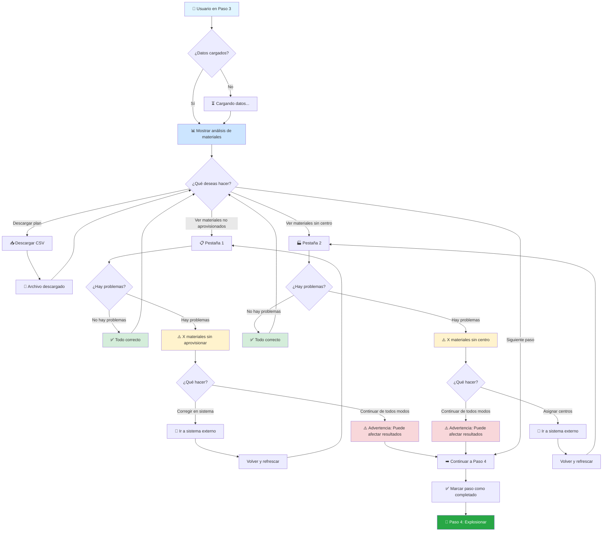
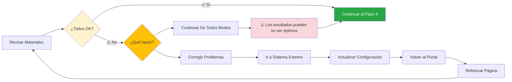
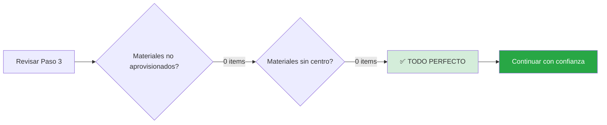
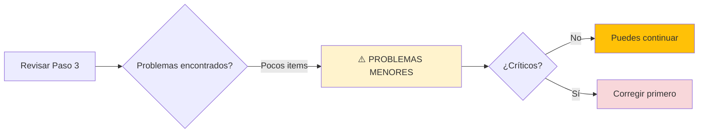
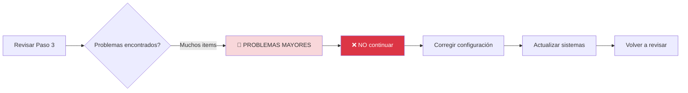
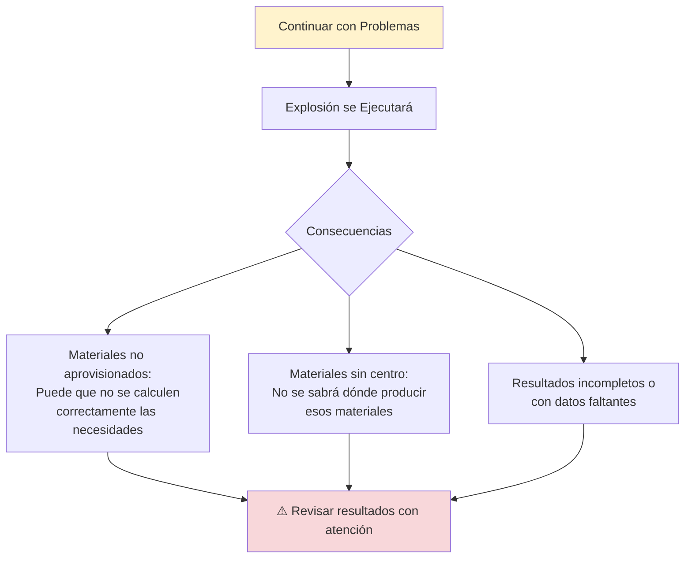
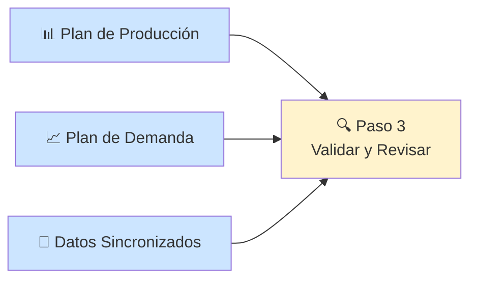
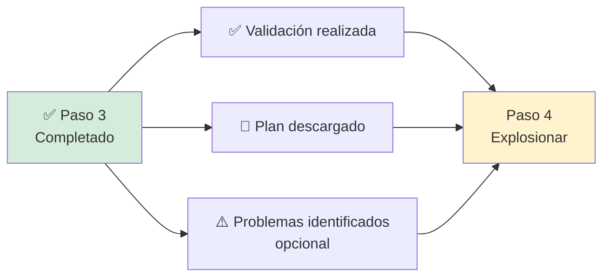

# Paso 3: Validación de Aprovisionamiento - Guía de Usuario

## 📋 ¿Qué es este paso?

El **Paso 3: Validación de Aprovisionamiento** es el tercer paso del proceso de Explosión de Materiales. En este paso, el sistema te muestra un análisis detallado de los materiales y te permite descargar el plan de producción generado en el paso anterior.

Este paso es principalmente **informativo y de revisión**: aquí verificas que todos los materiales estén correctamente configurados antes de ejecutar la explosión final. Piensa en esto como una "revisión de calidad" antes del paso final.

## 🎯 Objetivo

Revisar y validar que todos los materiales tengan la configuración correcta (aprovisionamiento y centros de producción asignados) antes de ejecutar el proceso final de explosión de materiales.

## 🔍 Qué Puedes Hacer en Este Paso

### 1️⃣ Descargar el Plan de Producción

**¿Qué es?**
Es un archivo CSV que contiene el plan de producción calculado en el Paso 2. Este archivo muestra cuánto necesitas producir de cada material.

**¿Para qué sirve?**
- Revisar las cantidades calculadas
- Compartir con tu equipo para revisión
- Guardar como respaldo antes de la explosión
- Usar en otros sistemas o análisis externos

**¿Cómo descargarlo?**
1. En la parte superior de la pantalla verás una sección azul con un botón
2. Haz clic en **"Descargar Plan"**
3. El archivo se descargará automáticamente
4. Nombre del archivo: `plan-produccion-{boom-id}.csv`

### 2️⃣ Revisar Materiales No Aprovisionados

**¿Qué son?**
Materiales que no tienen suficiente stock en inventario o no tienen proveedores asignados.

**¿Por qué es importante?**
Si un material no está aprovisionado, significa que no podrás cumplir con la producción planificada a menos que tomes acciones correctivas.

**¿Qué verás?**
Una tabla con:
- **Centro ID**: Centro donde se necesita el material
- **Material ID**: Código del material
- **Descripción**: Nombre del material
- **Marca, Presentación, Modelo**: Detalles del material
- **Tamaño, Color, Segmento, Línea**: Características adicionales

**Estados posibles:**
```
✅ Caso ideal: 0 materiales no aprovisionados
   "¡Excelente! Todos los materiales están aprovisionados correctamente"

⚠️ Caso con problemas: X materiales no aprovisionados
   Verás una tabla con todos los materiales que necesitan atención
```

### 3️⃣ Revisar Materiales Sin Centro de Producción

**¿Qué son?**
Materiales que no tienen un centro de producción asignado en el sistema.

**¿Por qué es importante?**
El sistema necesita saber dónde se producirá cada material. Sin esta información, no se puede generar un plan de producción válido.

**¿Qué verás?**
Una tabla con:
- **Año y Mes**: Período de producción
- **Centro de Venta**: Dónde se venderá
- **Material ID**: Código del material
- **Descripción**: Nombre del material
- **Cantidad Ventas**: Cuánto se necesita vender
- **Marca, Presentación, Modelo, Línea, Segmento**: Detalles

**Estados posibles:**
```
✅ Caso ideal: 0 materiales sin centro
   "¡Perfecto! Todos los materiales tienen centro de producción asignado"

⚠️ Caso con problemas: X materiales sin centro
   Verás una tabla con todos los materiales que necesitan un centro asignado
```

## 🔄 Flujo Completo del Proceso

### Diagrama del Proceso



### Flujo de Decisión



## 📝 Guía Detallada de Uso

### Paso a Paso

#### 1. Descargar el Plan de Producción

```
┌──────────────────────────────────────────────┐
│ 📥 Plan de Producción                        │
│                                               │
│ Descarga el archivo CSV con el               │
│ plan generado                                 │
│                                               │
│                  [Descargar Plan]             │
└──────────────────────────────────────────────┘
```

**Acción**: Haz clic en el botón **"Descargar Plan"**

**Resultado**: 
- El archivo `plan-produccion-{boom-id}.csv` se descargará
- Verás una notificación: "Descarga iniciada"
- El archivo se guarda en tu carpeta de Descargas

**Contenido del archivo**:
- Material ID
- Descripción del material
- Cantidad a producir
- Centro de producción
- Fecha de producción
- Otros detalles relevantes

#### 2. Revisar Materiales No Aprovisionados

**Navegar a la Pestaña**:
```
┌─────────────────────────────────────────────┐
│ [Materiales No Aprovisionados] │ Materiales Sin Centro │
│                                              │
│  ⚠️ Materiales No Aprovisionados  🔶 15 items│
│                                              │
│  ┌────────────────────────────────────────┐ │
│  │ Centro │ Material │ Descripción │ ...  │ │
│  ├────────────────────────────────────────┤ │
│  │ 1001   │ MAT123  │ Material A  │ ...  │ │
│  │ 1002   │ MAT456  │ Material B  │ ...  │ │
│  └────────────────────────────────────────┘ │
└─────────────────────────────────────────────┘
```

**Si hay 0 materiales**:
```
┌─────────────────────────────────────────────┐
│           ✅                                 │
│                                              │
│     ¡Excelente!                              │
│                                              │
│  Todos los materiales están                 │
│  aprovisionados correctamente                │
└─────────────────────────────────────────────┘
```

**Si hay materiales con problema**:
- Verás una tabla con todos los detalles
- Cada fila representa un material que necesita atención
- Puedes desplazarte horizontalmente para ver todos los campos

**¿Qué hacer?**
1. **Anotar los materiales** con problema
2. **Revisar el aprovisionamiento** en tu sistema ERP/SAP
3. **Actualizar los datos** si es necesario
4. **Volver al portal** y refrescar la página
5. O **continuar de todos modos** si decides proceder

#### 3. Revisar Materiales Sin Centro de Producción

**Navegar a la Pestaña**:
```
┌─────────────────────────────────────────────┐
│ Materiales No Aprovisionados │ [Materiales Sin Centro] │
│                                              │
│  🏭 Materiales Sin Centro de Producción  🔴 8 items│
│                                              │
│  ┌────────────────────────────────────────┐ │
│  │ Año │ Mes │ Centro Venta │ Material │  │ │
│  ├────────────────────────────────────────┤ │
│  │2025 │ 01  │ CV-001      │ MAT789   │  │ │
│  │2025 │ 01  │ CV-002      │ MAT012   │  │ │
│  └────────────────────────────────────────┘ │
└─────────────────────────────────────────────┘
```

**Si hay 0 materiales**:
```
┌─────────────────────────────────────────────┐
│           ✅                                 │
│                                              │
│     ¡Perfecto!                               │
│                                              │
│  Todos los materiales tienen centro         │
│  de producción asignado                      │
└─────────────────────────────────────────────┘
```

**Si hay materiales con problema**:
- Tabla con materiales sin centro asignado
- Información de año, mes y centro de venta
- Cantidades de venta requeridas

**¿Qué hacer?**
1. **Identificar los materiales** sin centro
2. **Asignar centros de producción** en tu sistema
3. **Actualizar la configuración** maestra
4. **Volver y refrescar** para verificar cambios
5. O **continuar** sabiendo que puede afectar los resultados

#### 4. Continuar al Siguiente Paso

Una vez revisados los materiales:

```
┌─────────────────────────────────────────────┐
│                                              │
│            [➡️ Siguiente Paso]               │
│                                              │
└─────────────────────────────────────────────┘
```

**Acción**: Haz clic en **"Siguiente Paso"**

**Resultado**:
- El sistema marca el Paso 3 como completado
- Se habilita el Paso 4 (Explosionar)
- Aparece una notificación: "Continuando, Avanzando al siguiente paso"
- Automáticamente avanzas al paso final

## 📊 Escenarios de Validación

### Escenario 1: Todo Perfecto ✅



**Mensaje que verás**:
```
✅ Materiales No Aprovisionados: 0 items
   ¡Excelente! Todos los materiales están aprovisionados correctamente

✅ Materiales Sin Centro: 0 items
   ¡Perfecto! Todos los materiales tienen centro de producción asignado
```

**Acción recomendada**: Continuar al Paso 4 sin preocupaciones.

### Escenario 2: Problemas Menores ⚠️



**Ejemplo**:
```
⚠️ Materiales No Aprovisionados: 3 items
   Hay algunos materiales que requieren atención

✅ Materiales Sin Centro: 0 items
   ¡Perfecto! Todos los materiales tienen centro de producción asignado
```

**Acción recomendada**:
- **Si no son críticos**: Puedes continuar y revisar después
- **Si son importantes**: Corregir antes de continuar

### Escenario 3: Problemas Mayores 🚨



**Ejemplo**:
```
🚨 Materiales No Aprovisionados: 45 items
   ATENCIÓN: Muchos materiales sin aprovisionar

🚨 Materiales Sin Centro: 23 items
   ATENCIÓN: Muchos materiales sin centro asignado
```

**Acción recomendada**:
- **NO continuar** hasta corregir
- **Revisar configuración** maestra de materiales
- **Actualizar aprovisionamiento** en tu sistema ERP
- **Asignar centros** de producción
- **Volver y refrescar** para verificar

## 🎓 Tour Guiado

### Cómo Iniciarlo

1. Busca el botón azul en la esquina superior derecha: **🔵 Tour: Validación de Aprovisionamiento**
2. Haz clic para iniciar el tour
3. Sigue las instrucciones en pantalla

### Qué Aprenderás

El tour te mostrará:

1. **El propósito del paso** de validación
2. **Cómo descargar** el plan de producción
3. **Dónde ver** los materiales no aprovisionados
4. **Dónde ver** los materiales sin centro
5. **Qué significan** los indicadores de estado
6. **Cómo continuar** al siguiente paso

## ⚠️ Consideraciones Importantes

### ¿Puedo Continuar con Problemas?

**Sí, puedes continuar**, pero debes entender las consecuencias:



### ¿Qué No Hace Este Paso?

Este paso **NO**:
- ❌ Corrige automáticamente los problemas
- ❌ Asigna centros de producción
- ❌ Crea aprovisionamiento de materiales
- ❌ Modifica datos maestros

Este paso **SÍ**:
- ✅ Muestra los problemas encontrados
- ✅ Te permite descargar el plan para revisión
- ✅ Te deja continuar si decides hacerlo
- ✅ Marca el paso como completado

### ¿Los Datos se Actualizan Automáticamente?

**No**, los datos se cargan una vez al entrar al paso.

**Para ver cambios**:
1. Haz las correcciones en tu sistema externo
2. Vuelve al portal
3. Refresca la página (F5)
4. Los datos se volverán a cargar

## 📋 Lista de Verificación

Antes de continuar al Paso 4, verifica:

**Revisión de Datos**:
- [ ] Descargaste el plan de producción
- [ ] Revisaste la pestaña de materiales no aprovisionados
- [ ] Revisaste la pestaña de materiales sin centro
- [ ] Anotaste los materiales con problemas (si los hay)

**Decisión**:
- [ ] Si hay problemas críticos, decidiste si corregir o continuar
- [ ] Estás conforme con los datos mostrados
- [ ] Sabes que puedes volver si es necesario

**Acción**:
- [ ] Hiciste clic en "Siguiente Paso"
- [ ] El Paso 4 se habilitó correctamente

## 💡 Consejos y Mejores Prácticas

### ✅ Antes de Iniciar

- **Descarga el plan** primero para tener un respaldo
- **Revisa ambas pestañas** aunque una esté en 0
- **Ten a mano** acceso a tu sistema ERP/SAP por si necesitas verificar datos
- **Anota los problemas** que encuentres para reportarlos después

### ⏳ Durante la Revisión

- **Lee la descripción** de cada material problemático
- **Verifica en tu sistema** si los datos son correctos
- **Documenta las inconsistencias** que encuentres
- **No te apresures** en este paso, es importante la revisión

### 🎯 Al Decidir si Continuar

**Continúa si**:
- ✅ No hay problemas (0 materiales en ambas pestañas)
- ✅ Los problemas son menores y no críticos
- ✅ Ya corregiste los problemas y refrescaste
- ✅ Entiendes las consecuencias y estás de acuerdo

**NO continúes si**:
- ❌ Hay muchos materiales con problemas
- ❌ Los materiales son críticos para la producción
- ❌ No sabes qué significan los problemas
- ❌ Puedes corregir fácilmente antes de continuar

### 🚫 Qué NO Hacer

- ❌ No ignores los problemas sin entenderlos
- ❌ No asumas que el sistema los corregirá solo
- ❌ No continúes si no estás seguro
- ❌ No te saltes la revisión del plan descargado

## 🔗 Integración con Otros Pasos

### Datos del Paso Anterior (Paso 2)



El Paso 3 usa el plan de producción generado en el Paso 2 para mostrarte:
- Qué materiales se necesitan
- Cuáles tienen problemas de configuración
- El archivo CSV descargable

### Datos para el Paso Siguiente (Paso 4)



El Paso 4 ejecutará la explosión con:
- Los datos validados (o aceptados con problemas)
- El conocimiento de qué materiales pueden tener issues
- El plan de producción como base

## ❓ Preguntas Frecuentes

### ¿Es obligatorio corregir todos los problemas?

**No**, puedes continuar con problemas, pero se recomienda corregir los críticos. Los resultados pueden no ser óptimos si hay muchos materiales con problemas.

### ¿Cuántas veces puedo descargar el plan?

**Todas las veces que quieras**. No hay límite. Cada descarga genera el mismo archivo.

### ¿Los datos se actualizan en tiempo real?

**No**, los datos se cargan al entrar al paso. Si haces cambios externos, debes refrescar la página (F5) para ver las actualizaciones.

### ¿Puedo volver a este paso después?

**Sí**, puedes volver a cualquier paso completado. Los datos estarán disponibles y podrás descargar el plan nuevamente.

### ¿Qué pasa si no descargo el plan?

**Nada crítico**, pero es recomendable descargarlo para:
- Tener un respaldo antes de la explosión
- Revisar con tu equipo
- Documentar el proceso

### ¿Puedo saltarme este paso?

**No**, es parte del flujo secuencial. Debes al menos hacer clic en "Siguiente Paso" para avanzar. Se recomienda hacer la revisión aunque sea rápida.

### ¿Los problemas afectarán la explosión final?

**Potencialmente sí**. Si hay materiales sin aprovisionar o sin centro:
- Pueden no calcularse correctamente
- Pueden aparecer con valores incorrectos
- Pueden faltar en los resultados finales

### ¿Puedo corregir problemas después de la explosión?

**No de forma retroactiva**. Si corriges después, deberás:
1. Volver al Paso 2
2. Re-ejecutar los procesos
3. Volver a este paso para validar
4. Ejecutar nuevamente la explosión

## 🆘 ¿Necesitas Ayuda?

Si encuentras problemas o no entiendes algún dato:

### Para Problemas Técnicos

1. **Toma una captura** de pantalla de los problemas
2. **Anota los materiales** con issues
3. **Descarga el plan** para análisis
4. **Contacta a soporte** técnico

### Para Problemas de Datos

1. **Revisa en tu sistema ERP/SAP** la configuración de materiales
2. **Consulta con tu equipo** de planeación de producción
3. **Verifica** con el área de aprovisionamiento
4. **Actualiza** los datos maestros si es necesario

**Información de Contacto**:
- 📧 Email: soporte@empresa.com
- 📞 Teléfono: +123 456 7890
- 💬 Chat: Disponible en la aplicación
- 📚 Wiki Interna: wiki.empresa.com/boom

## 📚 Documentación Relacionada

Para más información:

- [Paso 1: Carga de Insumos](./explosion-materiales-paso1-carga-insumos.md)
- [Paso 2: Generar Plan de Producción](./explosion-materiales-paso2-plan-produccion.md)
- [Paso 4: Explosionar](./explosion-materiales-paso4-explosionar.md)
- [Guía General](./README-explosion-materiales.md)

---

**Última actualización**: Enero 2025

**Versión del documento**: 1.0

**Equipo**: Portal Diveco

