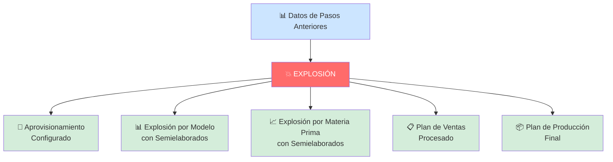
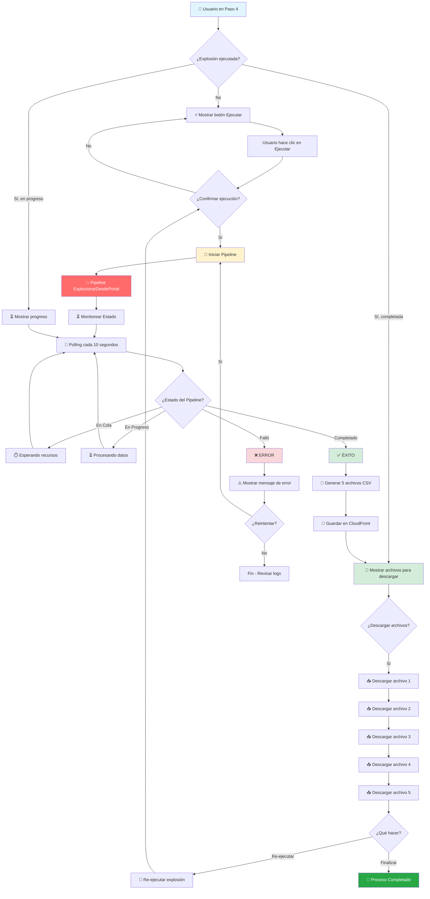
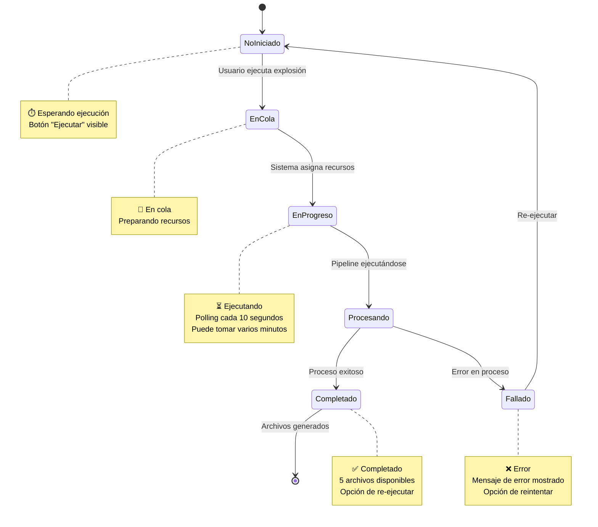
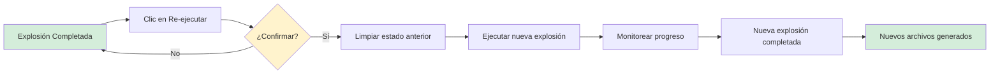
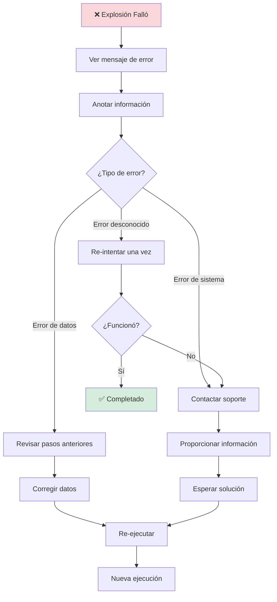

# Paso 4: Explosionar - Guía de Usuario

## 📋 ¿Qué es este paso?

El **Paso 4: Explosionar** es el paso **final y más importante** del proceso de Explosión de Materiales. En este paso, el sistema ejecuta el proceso de explosión que genera todos los reportes finales necesarios para el análisis de producción.

Este es el momento culminante: todos los datos cargados y procesados en los pasos anteriores se transforman en **5 archivos CSV** con información detallada sobre producción, materiales y aprovisionamiento.

## 🎯 Objetivo

Ejecutar el proceso final de explosión de materiales y generar 5 reportes detallados en formato CSV que contienen toda la información necesaria para la planeación de producción.

## 💥 ¿Qué Hace la Explosión?

La explosión toma todos los datos procesados y los "explota" (descompone) en sus componentes más detallados:



**En términos simples**: Es como tomar una receta compleja y descomponerla en:
- Qué ingredientes necesitas (aprovisionamiento)
- Cuánto necesitas de cada producto terminado (explosión por modelo)
- Cuánta materia prima necesitas (explosión por materia prima)
- Cuánto planeas vender (plan de ventas)
- Cuánto debes producir (plan de producción)

## 📁 Los 5 Archivos Generados

### 1️⃣ Aprovisionamiento Configurado

**Archivo**: `AprovisionamientoConfigurado.csv`

**¿Qué contiene?**
Información sobre cómo está configurado el aprovisionamiento de cada material: de dónde viene, quién lo provee, tiempos de entrega, etc.

**¿Para qué sirve?**
- Verificar que los materiales tengan fuentes de abastecimiento
- Revisar tiempos de entrega
- Validar configuración de proveedores
- Identificar materiales sin aprovisionamiento

**Información típica**:
- Material ID
- Centro de producción
- Proveedor
- Tiempo de entrega
- Cantidad mínima de pedido
- Centro de aprovisionamiento

### 2️⃣ Explosión del Plan por Modelo con Semielaborados

**Archivo**: `PlanModeloConSemielaborados.csv`

**¿Qué contiene?**
El detalle de cuánto necesitas producir de cada modelo (producto terminado) incluyendo los componentes semielaborados (partes que se fabrican primero para después ensamblar).

**¿Para qué sirve?**
- Ver la explosión por producto final
- Entender qué componentes semielaborados necesitas
- Planificar la producción por modelo
- Calcular necesidades por producto

**Información típica**:
- Modelo/Producto
- Cantidad a producir
- Componentes semielaborados
- Cantidades de cada componente
- Centro de producción
- Fechas de producción

### 3️⃣ Explosión del Plan por Materia Prima con Semielaborados

**Archivo**: `PlanModeloMateriasPrimaConSemielaborados.csv`

**¿Qué contiene?**
El detalle de cuánta materia prima necesitas comprar o tener disponible para producir todo lo planificado, incluyendo lo que se necesita para los semielaborados.

**¿Para qué sirve?**
- Saber cuánta materia prima comprar
- Planificar compras de materiales
- Verificar disponibilidad de inventario
- Calcular costos de materiales

**Información típica**:
- Materia prima ID
- Descripción del material
- Cantidad total necesaria
- Unidad de medida
- Centro donde se necesita
- Período de necesidad

### 4️⃣ Plan de Ventas

**Archivo**: `PlanVentas.csv`

**¿Qué contiene?**
El plan de ventas procesado y ajustado con toda la información de proyecciones.

**¿Para qué sirve?**
- Revisar las proyecciones de venta finales
- Comparar con el plan original
- Documentar el plan utilizado para la explosión
- Análisis de ventas proyectadas

**Información típica**:
- Producto
- Cantidad proyectada
- Período (año, mes, semana)
- Centro de venta
- Versión del plan

### 5️⃣ Plan de Producción

**Archivo**: `PlanProduccion.csv`

**¿Qué contiene?**
El plan de producción final que indica qué, cuánto, cuándo y dónde producir.

**¿Para qué sirve?**
- **Este es el archivo más importante**: Es tu guía de producción
- Planificar la producción día a día
- Asignar recursos
- Programar líneas de producción
- Base para órdenes de fabricación

**Información típica**:
- Material a producir
- Cantidad a producir
- Fecha de producción
- Centro de producción
- Lote de producción
- Prioridad

## 🔄 Flujo Completo del Proceso

### Diagrama del Proceso



### Estados del Pipeline



## 📝 Guía Detallada de Uso

### Paso a Paso: Ejecutar la Explosión

#### 1. Verificar Prerequisitos

Antes de ejecutar, asegúrate de que:
- ✅ Completaste el Paso 1 (Carga de Insumos)
- ✅ Completaste el Paso 2 (Generar Plan de Producción)
- ✅ Completaste el Paso 3 (Validación)
- ✅ Todos los pasos anteriores muestran ✅ verde

#### 2. Iniciar la Explosión

```
┌──────────────────────────────────────────────┐
│                                               │
│                                               │
│        [⚡ Ejecutar Explosión]                │
│                                               │
│                                               │
└──────────────────────────────────────────────┘
```

**Acción**: Haz clic en el botón grande **"Ejecutar Explosión"**

**Confirmación**: Aparecerá un mensaje:
```
⚠️ ¿Está seguro de que desea ejecutar la 
   explosión final de materiales?

   Este proceso procesará todos los datos y 
   generará los resultados finales. Esta acción 
   no se puede deshacer una vez iniciada.

   [Cancelar]  [Aceptar]
```

**Decisión**: 
- Si estás seguro → Haz clic en **"Aceptar"**
- Si quieres revisar algo → Haz clic en **"Cancelar"**

#### 3. Monitoreo del Proceso

Una vez iniciado, verás:

```
┌──────────────────────────────────────────────┐
│           🔵                                  │
│         (spinner)                             │
│                                               │
│   Pipeline en Progreso                        │
│                                               │
│   La explosión de materiales se está         │
│   ejecutando. Esto puede tomar varios        │
│   minutos.                                    │
│                                               │
└──────────────────────────────────────────────┘
```

**Estado actual**: El sistema está procesando todos los datos

**Notificación**: Verás un mensaje azul:
```
ℹ️ Pipeline iniciado
   Pipeline de explosión iniciado. ID: abc12345
```

#### 4. Esperar a que Complete

**¿Cuánto tarda?**
- **Mínimo**: 5-10 minutos
- **Promedio**: 10-20 minutos
- **Máximo**: 30 minutos (hay un timeout)

**¿Puedo cerrar la ventana?**
✅ **Sí**, el proceso continúa en el servidor. Puedes:
- Cerrar la pestaña
- Apagar tu computadora
- Volver más tarde

El progreso se guarda automáticamente.

#### 5. Explosión Completada

Cuando termine, verás:

```
┌──────────────────────────────────────────────┐
│           ✅                                  │
│                                               │
│   ¡Explosión Completada!                     │
│                                               │
│   La explosión de materiales se ha           │
│   ejecutado exitosamente. Los resultados     │
│   están disponibles para descarga.           │
│                                               │
│  📁 Archivos Generados                       │
│                                               │
│  [📄 Aprovisionamiento configurado    ↓]    │
│  [📄 Explosión por modelo...          ↓]    │
│  [📄 Explosión por materia prima...   ↓]    │
│  [📄 Plan de Ventas                   ↓]    │
│  [📄 Plan de Producción               ↓]    │
│                                               │
│        [🔄 Re-ejecutar Explosión]            │
│                                               │
└──────────────────────────────────────────────┘
```

**Notificación**: Mensaje verde de éxito:
```
✅ ¡Explosión completada!
   La explosión de materiales se ha ejecutado 
   exitosamente. Los resultados están listos.
```

### Descargar los Archivos

#### Cómo Descargar

Para cada archivo:
1. Haz clic en el botón del archivo que deseas
2. Se abrirá una nueva pestaña con la descarga
3. El archivo se guardará en tu carpeta de Descargas
4. Verás una notificación: "Descarga iniciada"

#### Nombre de los Archivos

Los archivos se descargarán con estos nombres:
1. `AprovisionamientoConfigurado.csv`
2. `PlanModeloConSemielaborados.csv`
3. `PlanModeloMateriasPrimaConSemielaborados.csv`
4. `PlanVentas.csv`
5. `PlanProduccion.csv`

#### Ubicación de los Archivos

Los archivos están almacenados en:
```
https://d1p0twkya81b3k.cloudfront.net/{boom-id}/{nombre-archivo}.csv
```

**Ejemplo**:
```
https://d1p0twkya81b3k.cloudfront.net/boom-123/PlanProduccion.csv
```

### Abrir los Archivos

Una vez descargados, puedes abrirlos con:
- ✅ **Microsoft Excel** (recomendado)
- ✅ **Google Sheets**
- ✅ **LibreOffice Calc**
- ✅ Cualquier editor de CSV

**Consejo**: Si los acentos o caracteres especiales no se ven bien, abre el archivo en Excel usando:
1. Archivo → Abrir
2. Selecciona el archivo CSV
3. En la importación, selecciona codificación **UTF-8**

## ⏱️ Tiempos y Duración

### Tiempo Estimado

```mermaid
gantt
    title Duración del Proceso de Explosión
    dateFormat  mm
    axisFormat  %M min
    
    section Ejecución
    Inicio y preparación        :a1, 01, 1m
    Procesamiento de datos      :a2, after a1, 8m
    Generación de archivos      :a3, after a2, 3m
    Guardado en CloudFront      :a4, after a3, 1m
    
    section Tiempos
    Mínimo (datos pequeños)     :b1, 05, 5m
    Promedio (datos medianos)   :b2, 12, 12m
    Máximo (datos grandes)      :b3, 25, 25m
```



### Factores que Afectan la Duración

**Rápido** (5-10 minutos):
- Pocas líneas de producción
- Pocos materiales
- Un solo centro de producción
- Datos simples

**Promedio** (10-20 minutos):
- Varias líneas de producción
- Cantidad moderada de materiales
- Múltiples centros
- Datos estándar

**Lento** (20-30 minutos):
- Muchas líneas de producción
- Miles de materiales
- Muchos centros de producción
- Cálculos complejos

### Timeout

**Límite máximo**: 30 minutos

Si el proceso tarda más de 30 minutos:
```
⚠️ Timeout del pipeline
   El pipeline de explosión ha tardado más de lo 
   esperado. Verifica el estado manualmente.
```

**¿Qué hacer?**
1. Contacta a soporte técnico
2. Proporciona el ID del pipeline
3. Espera indicaciones del equipo

## 🔄 Re-ejecutar la Explosión

### ¿Cuándo Re-ejecutar?

Puedes necesitar re-ejecutar si:
- ✅ Actualizaste datos del Paso 1, 2 o 3
- ✅ Necesitas datos más recientes
- ✅ La primera ejecución tuvo algún problema
- ✅ Quieres regenerar los reportes

### Cómo Re-ejecutar



**Pasos**:
1. Haz clic en el botón **"Re-ejecutar Explosión"**
2. Confirma la acción
3. El sistema limpiará los datos anteriores
4. Se ejecutará una nueva explosión
5. Los archivos anteriores serán reemplazados

**Confirmación**:
```
⚠️ ¿Está seguro de que desea re-ejecutar la 
   explosión de materiales?

   Esto reiniciará el proceso de explosión y 
   generará nuevos resultados. Los resultados 
   anteriores serán reemplazados.

   [Cancelar]  [Sí, re-ejecutar]
```

**⚠️ Importante**: Los archivos descargados anteriormente NO se borrarán de tu computadora, pero los nuevos archivos los reemplazarán en el servidor.

## ⚠️ Manejo de Errores

### Si la Explosión Falla



### Mensaje de Error

Verás algo como:
```
❌ Pipeline de explosión falló
   La explosión terminó con estado: Failed. 
   Puedes reintentar la ejecución.
```

### Qué Hacer

**1. Verificar datos previos**:
- Revisa que el Paso 1 esté correcto
- Verifica que el Paso 2 se completó bien
- Asegúrate que el Paso 3 no tenía errores críticos

**2. Anotar información**:
- ID del pipeline (si se muestra)
- Hora del error
- Mensaje de error exacto
- Tomar captura de pantalla

**3. Re-intentar**:
- Haz clic en **"Re-ejecutar Explosión"**
- Si falla nuevamente, contacta a soporte

**4. Contactar soporte**:
- Email o chat de soporte
- Proporcionar la información anotada
- Esperar indicaciones

## 🎓 Tour Guiado

### Cómo Iniciarlo

1. Busca el botón en la esquina superior derecha: **🔵 Tour: Explosión de Materiales**
2. Haz clic para iniciar
3. Sigue las instrucciones en pantalla

### Qué Aprenderás

El tour te mostrará:

1. **Propósito del paso**: Para qué sirve la explosión
2. **Botón de ejecución**: Cómo iniciar el proceso
3. **Estado de progreso**: Qué significa cuando está ejecutándose
4. **Explosión completada**: Qué verás al terminar
5. **Archivos generados**: Los 5 archivos CSV y qué contiene cada uno
6. **Re-ejecución**: Cómo volver a ejecutar si es necesario

## 💡 Consejos y Mejores Prácticas

### ✅ Antes de Ejecutar

- [ ] **Verifica que todos los pasos anteriores estén completos**
- [ ] **Revisa el Paso 3** para asegurar que no hay problemas críticos
- [ ] **Ten tiempo disponible** (mínimo 15 minutos)
- [ ] **Asegura buena conexión** a internet
- [ ] **Cierra aplicaciones pesadas** en tu computadora

### ⏳ Durante la Ejecución

- **Puedes cerrar la ventana** - El proceso continúa
- **No ejecutes dos veces** - Espera a que termine la primera
- **Anota el ID del pipeline** - Por si necesitas soporte
- **Revisa cada 5-10 minutos** - Para ver el progreso

### 🎯 Después de Completar

- **Descarga TODOS los archivos** - Los 5 son importantes
- **Guárdalos en una carpeta específica** - Para fácil ubicación
- **Renombra si es necesario** - Agregar fecha o versión
- **Respáldalos** - Guarda copia en otro lugar
- **Revisa los contenidos** - Abre cada archivo en Excel
- **Comparte con tu equipo** - Si es necesario

### 🚫 Qué NO Hacer

- ❌ No actualices la página mientras se ejecuta
- ❌ No ejecutes múltiples veces simultáneamente
- ❌ No ignores los errores sin entenderlos
- ❌ No descargues solo algunos archivos (descarga todos)
- ❌ No modifiques los archivos originales (haz copias primero)

## 📊 Usando los Resultados

### Plan de Trabajo Sugerido


**1. Descarga y organización** (15 minutos):
- Descarga los 5 archivos
- Crea una carpeta: `Boom_v{version}_{fecha}`
- Guarda todos los archivos ahí

**2. Revisión inicial** (30 minutos):
- Abre cada archivo en Excel
- Verifica que los datos se vean correctos
- Revisa las cantidades principales
- Anota cualquier anomalía

**3. Análisis detallado** (1-2 horas):
- **PlanProduccion.csv**: Qué y cuánto producir
- **AprovisionamientoConfigurado.csv**: De dónde viene cada material
- **PlanModeloConSemielaborados.csv**: Necesidades por producto
- **PlanModeloMateriasPrimaConSemielaborados.csv**: Necesidades de materia prima
- **PlanVentas.csv**: Proyecciones de venta

**4. Compartir con equipo** (según necesidad):
- Producción: Plan de Producción
- Compras: Explosión por materia prima
- Ventas: Plan de Ventas
- Logística: Aprovisionamiento configurado

**5. Implementación**:
- Crear órdenes de producción
- Generar órdenes de compra
- Programar líneas de fabricación
- Asignar recursos

## 📋 Lista de Verificación Final

Antes de dar por terminado el proceso:

**Ejecución**:
- [ ] La explosión se ejecutó sin errores
- [ ] Recibiste notificación de éxito
- [ ] Los 5 archivos están disponibles

**Descarga**:
- [ ] Descargaste los 5 archivos
- [ ] Todos los archivos se abrieron correctamente
- [ ] Los datos se ven correctos en Excel
- [ ] Guardaste los archivos en lugar seguro

**Validación**:
- [ ] Las cantidades tienen sentido
- [ ] No hay valores obviamente incorrectos
- [ ] Los totales cuadran
- [ ] Las fechas son correctas

**Documentación**:
- [ ] Anotaste la versión del boom
- [ ] Guardaste la fecha de ejecución
- [ ] Documentaste cualquier anomalía
- [ ] Informaste al equipo

## ❓ Preguntas Frecuentes

### ¿Puedo ejecutar la explosión más de una vez?

**Sí**, puedes ejecutar cuantas veces necesites usando el botón "Re-ejecutar". Cada ejecución generará nuevos archivos que reemplazarán los anteriores en el servidor (pero no en tu computadora si ya los descargaste).

### ¿Qué pasa si mi computadora se apaga durante la ejecución?

**No hay problema**. El proceso se ejecuta en el servidor, no en tu computadora. Cuando vuelvas a abrir el portal, verás el estado actualizado.

### ¿Puedo descargar los archivos después de cerrar la ventana?

**Sí**, mientras no ejecutes una nueva explosión. Los archivos quedan disponibles en el servidor hasta que ejecutes una nueva explosión que los reemplace.

### ¿Cuánto espacio ocupan los archivos?

Varía según la cantidad de datos:
- **Pequeños**: 100 KB - 1 MB cada uno
- **Medianos**: 1 MB - 10 MB cada uno
- **Grandes**: 10 MB - 50 MB cada uno

En total, generalmente menos de 100 MB los 5 archivos juntos.

### ¿Puedo compartir estos archivos con mi equipo?

**Sí**, son archivos CSV estándar que puedes compartir por email, Teams, Drive, etc. No contienen información sensible del sistema, solo datos de producción.

### ¿Qué archivo es el más importante?

**El Plan de Producción** (`PlanProduccion.csv`) es el más importante porque te dice exactamente qué, cuánto y cuándo producir. Sin embargo, los otros 4 son necesarios para entender el contexto completo.

### ¿Necesito descargar todos los archivos?

**Sí, recomendado**. Aunque cada uno tiene un propósito específico, juntos forman un análisis completo. Algunos departamentos pueden necesitar unos más que otros.

### ¿Los archivos tienen formato específico para importar a otro sistema?

Sí, son archivos CSV estándar que pueden importarse a:
- ✅ Excel / Google Sheets
- ✅ ERP / SAP
- ✅ Sistemas de planeación
- ✅ Bases de datos
- ✅ Power BI / Tableau

### ¿Puedo modificar los archivos?

**Sí**, son tuyos para usar como necesites. Pero guarda una copia de los originales antes de hacer cambios, para tener respaldo.

## 🆘 ¿Necesitas Ayuda?

### Para Problemas Técnicos

1. **Timeout del pipeline** → Contacta a soporte con el ID del pipeline
2. **Error en ejecución** → Re-intenta una vez, si falla contacta a soporte
3. **No se descargan los archivos** → Verifica tu conexión, intenta otro navegador
4. **Archivos corruptos** → Re-ejecuta la explosión

### Para Problemas de Datos

1. **Datos incorrectos** → Revisa los pasos anteriores
2. **Cantidades no cuadran** → Verifica el Paso 1 y 2
3. **Materiales faltantes** → Revisa el Paso 3
4. **Fechas incorrectas** → Verifica versión del boom

**Información de Contacto**:
- 📧 Email: soporte@empresa.com
- 📞 Teléfono: +123 456 7890
- 💬 Chat: Disponible en la aplicación
- 📚 Wiki: wiki.empresa.com/boom

## 🎉 ¡Felicitaciones!

Si llegaste hasta aquí y completaste todos los pasos:

```
✅ Paso 1: Carga de Insumos
✅ Paso 2: Generar Plan de Producción  
✅ Paso 3: Validación de Aprovisionamiento
✅ Paso 4: Explosionar

🎊 ¡Proceso Completo!
```

Has completado exitosamente todo el proceso de Explosión de Materiales. Ahora tienes 5 reportes detallados que te ayudarán a:
- 📊 Planificar la producción
- 📦 Gestionar el aprovisionamiento
- 📈 Proyectar necesidades de materiales
- 📋 Organizar las operaciones
- 🎯 Cumplir con las metas de venta

## 📚 Documentación Relacionada

Para más información:

- [Paso 1: Carga de Insumos](./explosion-materiales-paso1-carga-insumos.md)
- [Paso 2: Generar Plan de Producción](./explosion-materiales-paso2-plan-produccion.md)
- [Paso 3: Validación de Aprovisionamiento](./explosion-materiales-paso3-validacion.md)
- [Guía General](./README-explosion-materiales.md)
- [Arquitectura del Sistema](./explosion-materiales-architecture.md)

---

**Última actualización**: Enero 2025

**Versión del documento**: 1.0

**Equipo**: Portal Diveco

