# Integración con Microsoft Graph API

## Resumen

Este documento describe la implementación del API de Microsoft Graph en el portal para obtener información de usuarios del tenant de Microsoft Azure AD. La integración permite obtener datos de usuarios, fotos de perfil, reportes directos y estructuras jerárquicas organizacionales.

## Arquitectura General

La implementación sigue un patrón de arquitectura en capas:

1. **Capa de Endpoints (Server API)**: Endpoints en Nuxt.js que actúan como proxy hacia Microsoft Graph
2. **Capa de Autenticación**: Manejo centralizado de tokens de acceso OAuth 2.0
3. **Capa de Componentes**: Componentes Vue que consumen los endpoints
4. **Capa de Cache**: Sistema de cache para optimizar las consultas

### Diagrama de Arquitectura

```mermaid
graph TD
    A["🏠 SubordinatesDisplay.vue"] --> B["🔐 Token Endpoint"]
    A --> C["👤 User Info Endpoint"]
    A --> D["📊 Direct Reports Endpoint"]
    A --> E["📸 User Photo Endpoint"]

    B --> F["🌐 Microsoft Graph OAuth"]
    C --> G["🌐 Microsoft Graph Users API"]
    D --> H["🌐 Microsoft Graph DirectReports API"]
    E --> I["🌐 Microsoft Graph Photos API"]

    A --> J["🔄 CitizenHierarchyItem.vue<br/>(Componente Recursivo)"]
    J --> K["💾 Cache de Fotos"]
    J --> L["🏢 Verificación SAP"]

    F --> M["🎫 Access Token"]
    M --> G
    M --> H
    M --> I

    G --> N["📋 Datos de Usuario"]
    H --> O["👥 Lista de Subordinados"]
    I --> P["🖼️ Foto en Base64"]

    N --> J
    O --> J
    P --> K

    L --> Q["💼 API SAP"]
    Q --> R["✅ Usuario Activo en SAP"]
    R --> J

    style A fill:#e1f5fe
    style J fill:#f3e5f5
    style F fill:#fff3e0
    style G fill:#e8f5e8
    style H fill:#e8f5e8
    style I fill:#e8f5e8
    style Q fill:#fff8e1
```



## Configuración

### Variables de Entorno

La aplicación requiere las siguientes variables de configuración en `nuxt.config.ts`:

```typescript
runtimeConfig: {
  msTenantId: "",        // ID del tenant de Azure AD
  msClientId: "",        // Application (client) ID
  msClientSecret: "",    // Client secret
}
```

Estas variables deben configurarse en las variables de entorno del sistema:

- `NUXT_MS_TENANT_ID`
- `NUXT_MS_CLIENT_ID`
- `NUXT_MS_CLIENT_SECRET`

### Permisos Requeridos en Azure AD

La aplicación registrada en Azure AD debe tener los siguientes permisos de Microsoft Graph:

- `User.Read.All`: Leer perfiles de todos los usuarios
- `User.ReadBasic.All`: Leer información básica de usuarios
- `Directory.Read.All`: Leer información del directorio (para reportes directos)

## Endpoints del API

### 1. Token de Acceso (`/api/microsoft-graph/token`)

**Archivo**: `server/api/microsoft-graph/token.post.ts`

**Propósito**: Obtiene un token de acceso OAuth 2.0 usando el flujo Client Credentials.

**Método**: POST

**Parámetros**: Ninguno (usa credenciales de configuración)

**Respuesta**:

```typescript
{
  success: boolean,
  access_token: string,
  token_type: string,
  expires_in: number
}
```

**Flujo de Autenticación**:

1. Construye la URL de token: `https://login.microsoftonline.com/{tenantId}/oauth2/v2.0/token`
2. Envía credenciales usando `grant_type=client_credentials`
3. Solicita scope: `https://graph.microsoft.com/.default`
4. Retorna el token de acceso para usar en otras consultas

### 2. Información de Usuario (`/api/microsoft-graph/user-info`)

**Archivo**: `server/api/microsoft-graph/user-info.post.ts`

**Propósito**: Obtiene información detallada de un usuario específico.

**Método**: POST

**Parámetros**:

```typescript
{
  userName: string; // Email o ID del usuario
}
```

**Respuesta**:

```typescript
{
  success: boolean,
  userData: {
    id: string,
    displayName: string,
    mail: string,
    jobTitle: string,
    // ... otros campos de Microsoft Graph
  },
  message: string
}
```

### 3. Reportes Directos (`/api/microsoft-graph/direct-reports`)

**Archivo**: `server/api/microsoft-graph/direct-reports.post.ts`

**Propósito**: Obtiene la lista de subordinados directos de un usuario.

**Método**: POST

**Parámetros**:

```typescript
{
  userName: string; // Email o ID del usuario
}
```

**Respuesta**:

```typescript
{
  success: boolean,
  userName: string,
  directReports: {
    value: Array<{
      id: string,
      displayName: string,
      mail: string,
      jobTitle: string,
      // ... otros campos
    }>
  }
}
```

### 4. Foto de Usuario (`/api/microsoft-graph/user-photo`)

**Archivo**: `server/api/microsoft-graph/user-photo.post.ts`

**Propósito**: Obtiene la foto de perfil de un usuario y la convierte a base64.

**Método**: POST

**Parámetros**:

```typescript
{
  userId: string; // ID del usuario
}
```

**Respuesta**:

```typescript
{
  success: boolean,
  userId: string,
  hasPhoto: boolean,
  photoData: string | null  // Data URI en formato base64
}
```

## Integración en Componentes Vue

### SubordinatesDisplay.vue

Este componente principal maneja la carga y visualización de la jerarquía organizacional:

#### Funciones Principales:

1. **`getAccessToken()`**: Obtiene token de Microsoft Graph
2. **`getGraphUserData(userName)`**: Obtiene información del usuario
3. **`getUserPhoto(userId)`**: Obtiene foto del usuario con cache
4. **`getDirectReportsForUser(userName)`**: Obtiene subordinados directos
5. **`getDirectReportsRecursive(userName, maxDepth, currentDepth)`**: Construye jerarquía completa

#### Sistema de Cache:

```typescript
const userPhotos = ref(new Map()); // Cache de fotos
const loadingPhotos = ref(new Set()); // Estados de carga de fotos
const sapUsersCache = ref(new Map()); // Cache de usuarios SAP
const loadingSapUsers = ref(new Set()); // Estados de carga SAP
```

#### Manejo de Errores:

- **Usuarios problemáticos**: Lista de usuarios que causan errores conocidos
- **Reintentos automáticos**: Continúa con otros usuarios si uno falla
- **Fallbacks**: Muestra iniciales si no hay foto disponible

### CitizenHierarchyItem.vue

Componente recursivo que renderiza cada elemento de la jerarquía:

#### Características:

1. **Visualización de Avatar**: Muestra foto de Microsoft Graph o iniciales como fallback
2. **Estados de Carga**: Indicadores visuales durante la carga de fotos
3. **Información del Usuario**: Nombre, cargo, email obtenidos de Microsoft Graph
4. **Integración SAP**: Verifica si el usuario existe en SAP para habilitar acciones

#### Props Principales:

```typescript
{
  citizen: Object,           // Datos del ciudadano de Microsoft Graph
  userPhotos: Map,          // Cache de fotos
  loadingPhotos: Set,       // Estados de carga
  expandedSubordinates: Set, // Control de expansión
  level: Number             // Nivel de jerarquía
}
```

## Flujo de Autenticación OAuth 2.0

### Client Credentials Flow

La aplicación utiliza el flujo **Client Credentials** de OAuth 2.0, que es apropiado para aplicaciones server-to-server que no requieren interacción del usuario:

```mermaid
sequenceDiagram
    participant App as Nuxt Server
    participant AAD as Azure AD
    participant Graph as Microsoft Graph

    Note over App: Usuario solicita datos
    App->>AAD: POST /oauth2/v2.0/token<br/>grant_type=client_credentials<br/>client_id={clientId}<br/>client_secret={clientSecret}<br/>scope=https://graph.microsoft.com/.default

    AAD-->>App: Access Token<br/>(válido por ~1 hora)

    App->>Graph: GET /v1.0/users/{user}<br/>Authorization: Bearer {token}
    Graph-->>App: Datos del usuario

    App-->>App: Procesar y retornar datos al cliente
```



### Configuración en Azure AD

Para que la integración funcione, la aplicación debe estar registrada en Azure AD con:

1. **Tipo de aplicación**: Web Application
2. **Permisos API**: Microsoft Graph Application Permissions (no Delegated)
3. **Consentimiento del administrador**: Requerido para permisos de aplicación
4. **Secret de cliente**: Configurado y válido

## Flujo de Datos Completo

### 1. Inicialización


### 2. Carga de Jerarquía

```mermaid
sequenceDiagram
    participant C as Component
    participant API as Nuxt API
    participant MS as Microsoft Graph

    C->>API: POST /api/microsoft-graph/direct-reports
    API->>MS: GET /v1.0/users/{userName}/directReports
    MS-->>API: Direct Reports
    API-->>C: Subordinates List

    Note over C: Para cada subordinado
    C->>C: Llamada recursiva para obtener sub-subordinados

    Note over C: Cargar fotos en paralelo
    C->>API: POST /api/microsoft-graph/user-photo (múltiples)
    API->>MS: GET /v1.0/users/{userId}/photo/$value (múltiples)
    MS-->>API: Photo Binary Data
    API-->>C: Base64 Photo Data
```



### 3. Verificación SAP


## Optimizaciones Implementadas

### 1. Cache de Datos

- **Fotos de usuario**: Cache en Map para evitar descargas duplicadas
- **Estados SAP**: Cache de verificaciones de usuarios SAP
- **Estados de carga**: Sets para rastrear operaciones en progreso

### 2. Manejo de Errores Robusto

- **Lista de usuarios problemáticos**: Evita consultas a usuarios que causan errores conocidos
- **Continuación en errores**: Si un usuario falla, continúa con los demás
- **Fallbacks visuales**: Muestra iniciales cuando no hay foto disponible

### 3. Carga Paralela

- **Fotos**: Carga múltiples fotos en paralelo
- **Verificaciones SAP**: Verifica múltiples usuarios simultáneamente
- **Jerarquías**: Construye múltiples ramas de jerarquía en paralelo

## Consideraciones de Seguridad

### 1. Autenticación

- Usa flujo OAuth 2.0 Client Credentials (server-to-server)
- Los tokens se obtienen dinámicamente en cada solicitud
- No se almacenan tokens en el cliente

### 2. Autorización

- La aplicación debe estar registrada en Azure AD
- Requiere permisos específicos de Microsoft Graph
- Solo accede a datos del tenant configurado

### 3. Datos Sensibles

- Las credenciales se manejan a través de variables de entorno
- Los tokens no se exponen al cliente
- Las fotos se procesan server-side antes de enviar al cliente

## Limitaciones y Consideraciones

### 1. Límites de Rate Limiting

- Microsoft Graph tiene límites de requests por minuto
- Se implementa manejo de errores para límites excedidos
- Cache ayuda a reducir la cantidad de requests

### 2. Usuarios Problemáticos

- Algunos usuarios pueden causar errores 404 o 500
- Sistema automático de detección y exclusión de usuarios problemáticos
- Logs detallados para debugging

### 3. Dependencias

- Requiere conectividad a internet para acceder a Microsoft Graph
- Depende de la configuración correcta del tenant de Azure AD
- Los permisos deben estar aprobados por el administrador del tenant

## Uso en el Código

### Obtener Información de Usuario

```typescript
// En un componente Vue
const getUserData = async (email) => {
  try {
    const response = await $fetch("/api/microsoft-graph/user-info", {
      method: "POST",
      body: { userName: email },
    });

    if (response.success) {
      return response.userData;
    }
  } catch (error) {
    console.error("Error obteniendo datos de usuario:", error);
    return null;
  }
};
```

### Obtener Foto de Usuario

```typescript
// En un componente Vue
const getUserPhoto = async (userId) => {
  try {
    const response = await $fetch("/api/microsoft-graph/user-photo", {
      method: "POST",
      body: { userId },
    });

    if (response.success && response.hasPhoto) {
      return response.photoData; // Data URI base64
    }
    return null;
  } catch (error) {
    console.error("Error obteniendo foto:", error);
    return null;
  }
};
```

### Obtener Subordinados

```typescript
// En un componente Vue
const getDirectReports = async (email) => {
  try {
    const response = await $fetch("/api/microsoft-graph/direct-reports", {
      method: "POST",
      body: { userName: email },
    });

    if (response.success) {
      return response.directReports.value;
    }
    return [];
  } catch (error) {
    console.error("Error obteniendo reportes directos:", error);
    return [];
  }
};
```

## Troubleshooting

### Errores Comunes

1. **401 Unauthorized**:
   - Verificar credenciales de Azure AD
   - Confirmar que los permisos están aprobados
   - Revisar que el tenant ID sea correcto

2. **404 Not Found**:
   - El usuario no existe en el tenant
   - Email incorrecto o usuario desactivado
   - Usuario se agrega automáticamente a lista problemática

3. **403 Forbidden**:
   - Permisos insuficientes en Azure AD
   - Aplicación no tiene acceso al recurso solicitado

4. **429 Too Many Requests**:
   - Rate limiting de Microsoft Graph
   - Implementar delays entre requests
   - Usar cache más agresivo

### Logs de Debugging

Los endpoints incluyen logging detallado:

```typescript
console.log("tenantId", msTenantId);
console.log("clientId", msClientId);
console.log("Obteniendo información del usuario:", userName);
console.log("Respuesta de Microsoft Graph para usuario:", graphResponse);
```

## Detalles de Implementación Técnica

### Jerarquía Recursiva de Subordinados

La aplicación construye una estructura jerárquica completa utilizando el endpoint `/directReports` de manera recursiva:

```typescript
// Función recursiva en SubordinatesDisplay.vue
const getDirectReportsRecursive = async (
  userName,
  maxDepth = 3,
  currentDepth = 0,
) => {
  if (currentDepth >= maxDepth) return [];

  const reports = await getDirectReportsForUser(userName);

  // Para cada subordinado, obtener sus propios subordinados
  const processedReports = await Promise.all(
    reports.map(async (report) => {
      const subordinates = await getDirectReportsRecursive(
        report.mail,
        maxDepth,
        currentDepth + 1,
      );

      return {
        ...report,
        subordinates,
        hasSubordinates: subordinates.length > 0,
        subordinatesCount: subordinates.length,
      };
    }),
  );

  return processedReports;
};
```

### Sistema de Cache Inteligente

#### Cache de Fotos de Usuario

```typescript
// Estados reactivos para cache
const userPhotos = ref(new Map()); // userId -> base64 photo data
const loadingPhotos = ref(new Set()); // userId set para evitar duplicados

// Función de carga con cache
const getUserPhoto = async (userId) => {
  // Verificar cache primero
  if (userPhotos.value.has(userId)) {
    return userPhotos.value.get(userId);
  }

  // Evitar requests duplicados
  if (loadingPhotos.value.has(userId)) {
    return null;
  }

  loadingPhotos.value.add(userId);

  try {
    const response = await $fetch("/api/microsoft-graph/user-photo", {
      method: "POST",
      body: { userId },
    });

    const photoData = response.hasPhoto ? response.photoData : null;
    userPhotos.value.set(userId, photoData);
    return photoData;
  } finally {
    loadingPhotos.value.delete(userId);
  }
};
```

#### Cache de Verificación SAP

```typescript
// Cache para verificaciones SAP
const sapUsersCache = ref(new Map()); // email -> boolean
const loadingSapUsers = ref(new Set()); // email set para evitar duplicados

const checkSapUser = async (email) => {
  if (sapUsersCache.value.has(email)) {
    return sapUsersCache.value.get(email);
  }

  if (loadingSapUsers.value.has(email)) {
    return false;
  }

  // ... lógica de verificación SAP
};
```

### Manejo Robusto de Errores

#### Lista de Usuarios Problemáticos

```typescript
// Sistema automático de detección de usuarios problemáticos
const problematicUsers = new Set([
  "pruebas@camasolympia.onmicrosoft.com",
  // Se agregan automáticamente usuarios que fallan
]);

const getDirectReportsForUser = async (userName) => {
  // Verificar lista de usuarios problemáticos
  if (problematicUsers.has(userName)) {
    console.warn(`⚠️ Saltando usuario problemático: ${userName}`);
    return [];
  }

  try {
    // ... lógica de consulta
  } catch (error) {
    if (error.status === 404 || error.status === 500) {
      // Agregar automáticamente a lista problemática
      problematicUsers.add(userName);
    }
    return []; // Continuar con otros usuarios
  }
};
```

### Integración Dual: Microsoft Graph + SAP

La aplicación combina datos de dos fuentes:

1. **Microsoft Graph**: Estructura organizacional, fotos, información básica
2. **SAP**: Verificación de usuarios activos, acciones de gestión

```typescript
// Proceso de enriquecimiento de datos
const enrichCitizenData = async (citizen) => {
  // 1. Datos base de Microsoft Graph
  const msGraphData = {
    id: citizen.id,
    displayName: citizen.displayName,
    mail: citizen.mail,
    jobTitle: citizen.jobTitle,
  };

  // 2. Verificar existencia en SAP
  const hasSapUser = await checkSapUser(citizen.mail);

  // 3. Obtener foto de perfil
  const photo = await getUserPhoto(citizen.id);

  // 4. Combinar datos
  return {
    ...msGraphData,
    hasSapUser,
    photo,
    // Habilitar acciones solo si existe en SAP
    canReset: hasSapUser,
    canUnlock: hasSapUser,
  };
};
```

### Componente CitizenHierarchyItem.vue

#### Renderizado Condicional Basado en Estado SAP

```vue
<!-- Botones de acción solo para usuarios SAP -->
<template v-if="citizen.hasSapUser">
  <UButton
    size="xs"
    variant="outline"
    color="cyan"
    :loading="isResetting"
    :disabled="isResetting || isUnlocking"
    @click="handleCitizenAction('reset')"
  >
    <UIcon name="i-heroicons-key" class="w-3 h-3" />
  </UButton>

  <UButton
    size="xs"
    variant="outline"
    color="orange"
    :loading="isUnlocking"
    :disabled="isResetting || isUnlocking"
    @click="handleCitizenAction('unlock')"
  >
    <UIcon name="i-heroicons-lock-open" class="w-3 h-3" />
  </UButton>
</template>
```

#### Sistema de Notificaciones Locales

```typescript
// Estado para notificaciones por componente
const statusMessage = ref({
  show: false,
  message: "",
  type: "info",
});

const showStatusMessage = (message, type = "info") => {
  statusMessage.value.show = false;

  setTimeout(() => {
    statusMessage.value = {
      show: true,
      message,
      type,
    };
  }, 100);
};
```

## Próximos Pasos

### Mejoras Sugeridas

1. **Cache Persistente**: Implementar cache en base de datos para tokens y datos de usuario
2. **Retry Logic**: Implementar reintentos automáticos con backoff exponencial
3. **Batch Requests**: Usar Microsoft Graph batch API para múltiples requests
4. **Real-time Updates**: Implementar webhooks para actualizaciones en tiempo real
5. **Monitoring**: Agregar métricas y alertas para el uso del API

### Consideraciones de Escalabilidad

1. **Token Management**: Implementar cache de tokens con renovación automática
2. **Request Pooling**: Agrupar requests similares para reducir latencia
3. **Error Recovery**: Mecanismos más sofisticados de recuperación de errores
4. **Performance Monitoring**: Métricas de tiempo de respuesta y success rate

## Resumen de Archivos Importantes

### Endpoints del Servidor

- `server/api/microsoft-graph/token.post.ts` - Autenticación OAuth 2.0
- `server/api/microsoft-graph/user-info.post.ts` - Información de usuario
- `server/api/microsoft-graph/direct-reports.post.ts` - Subordinados directos
- `server/api/microsoft-graph/user-photo.post.ts` - Fotos de perfil

### Componentes Frontend

- `app/components/SubordinatesDisplay.vue` - Componente principal de jerarquía
- `app/components/CitizenHierarchyItem.vue` - Elemento recursivo de jerarquía

### Configuración

- `nuxt.config.ts` - Configuración de runtime para credenciales

## Ejemplo de Uso Completo

```typescript
// 1. Inicializar y obtener jerarquía completa
const loadHierarchy = async () => {
  try {
    // Obtener token
    await getAccessToken();

    // Obtener datos del usuario actual
    const userData = await getGraphUserData(currentUserEmail);

    // Construir jerarquía recursiva
    const hierarchy = await getDirectReportsRecursive(currentUserEmail);

    // Verificar usuarios SAP para toda la jerarquía
    const allUsers = getAllCitizensFlat(hierarchy);
    await checkAllSapUsers(allUsers);

    // Cargar fotos para todos los usuarios
    await loadAllUserPhotos(allUsers);

    // Actualizar estado del componente
    directReports.value = hierarchy;
  } catch (error) {
    console.error("Error cargando jerarquía:", error);
  }
};
```

---

_Documentación generada para el proyecto Portal - Integración Microsoft Graph API_
_Última actualización: Enero 2025_
